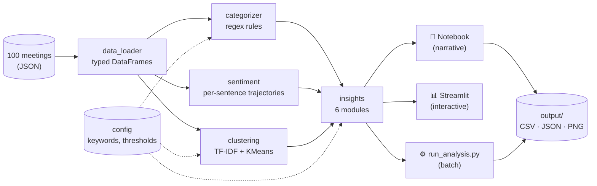

# Transcript Intelligence

> Process meeting transcripts from a B2B SaaS company and surface topic categorization, sentiment trends, and strategic insights for product + engineering leadership.

[](tests/)
[](validate.py)
[](requirements.txt)
[](LICENSE)

---

## Contents

- [What this does](#what-this-does)
- [Quick start](#quick-start)
- [Architecture](#architecture)
- [Project layout](#project-layout)
- [Key findings](#key-findings)
- [Testing & validation](#testing--validation)
- [Interactive dashboard](#interactive-dashboard)
- [Documentation](#documentation)

---

## What this does

Given ~100 meeting transcripts (support cases, customer-facing calls, and internal meetings), this pipeline:

1. **Categorizes** every meeting along three dimensions — call type, purpose, and product area — using a hybrid of regex rules and TF-IDF clustering
2. **Analyzes sentiment** at both meeting and *sentence* granularity, surfacing within-call friction moments that the meeting-level score hides
3. **Generates six strategic insights** — customer churn risk, incident blast radius, action item bottlenecks, competitive language, speaker dominance, and within-meeting negative pivots

Three interfaces over the same `src/` modules:

| Interface | When to use |
|---|---|
| `transcript_intelligence.ipynb` | Reviewable narrative — the deliverable |
| `dashboard.py` (Streamlit) | Live demo, drill-downs, Q&A |
| `run_analysis.py` | Headless CI / batch refresh |

## Quick start

```bash
make install     # pip install -r requirements.txt
make test        # 31 unit tests
make validate    # 10 semantic audits
make run         # full pipeline → output/
make dashboard   # streamlit run dashboard.py
make notebook    # jupyter lab transcript_intelligence.ipynb
```

Or without Make:

```bash
pip install -r requirements.txt
python -m pytest tests/ -v
python validate.py
python run_analysis.py
streamlit run dashboard.py
```

## Architecture



See [`docs/ARCHITECTURE.md`](docs/ARCHITECTURE.md) for module dependency, data model, and pipeline-stage diagrams. See [`docs/APPROACH.md`](docs/APPROACH.md) for methodology decisions.

## Project layout

```
transcript-intelligence/
├── run_analysis.py               # end-to-end CLI pipeline
├── dashboard.py                  # interactive Streamlit dashboard
├── validate.py                   # semantic audits
├── transcript_intelligence.ipynb # narrative notebook
├── Makefile                      # common commands
├── src/
│   ├── config.py                 # keyword maps, thresholds (single source of truth)
│   ├── data_loader.py            # raw JSON → typed DataFrames
│   ├── categorizer.py            # call type / purpose / product / customer
│   ├── sentiment.py              # meeting + sentence-level trajectories
│   ├── clustering.py             # TF-IDF + KMeans, k via silhouette
│   ├── insights.py               # 6 strategic insight modules
│   └── visualizations.py         # matplotlib charts (notebook & CLI)
├── tests/
│   └── test_categorizer.py       # 31 unit tests
├── docs/
│   ├── ARCHITECTURE.md           # system design with diagrams
│   └── APPROACH.md               # methodology decisions
└── output/                       # generated artifacts (gitignored)
```

## Key findings

| Area | Headline |
|---|---|
| Categorization | 100 meetings → 3 call types · 11 purposes · 4 product areas; **k=7** content clusters chosen by silhouette |
| Sentiment | Support 2.94 < internal 3.42 < external 3.71. Detect product 3.20 — outage drag |
| Outage impact | One incident touched **68% of all meetings**, dragged sentiment by **0.77 points** |
| Top at-risk customers | Northstar Pharma · Cobalt Software · Summit Trust |
| Execution bottleneck | Maria Santos owns 31 action items (most by far) |
| Conversation health | Support calls have **51% single-speaker dominance** — agents may be over-talking |
| Friction moments | **9 meetings** with sharp within-call sentiment drops (sentence-level analysis) |

## Testing & validation

Two complementary layers — **unit tests** verify rules behave as written; **semantic validation** asks whether the rules hold up against the data:

```bash
python -m pytest tests/ -v   # 31 tests, ~2s
python validate.py           # 10 audits with PASS / WARN / FAIL flags
```

Validation checks include rule coverage, customer extraction completeness, cross-reference of detected products against the dataset's own `topics` field, cluster homogeneity, sentiment alignment between meeting-level and sentence-level signals, and churn risk distribution. Current state: **9 pass, 1 warn, 0 fail.** The remaining warning is a real finding (two clusters re-discover rule categories), not a defect.

## Interactive dashboard

```bash
streamlit run dashboard.py
```

Five tabs with sidebar filters by call type, product area, and date:

1. **Overview** — sentiment by call type & purpose, weekly trend with outage marker, distributions
2. **Customers (at risk)** — full risk-tier table with per-customer drill-down
3. **Incident impact** — KPIs, scatter plot of all affected meetings, response timeline
4. **Meeting drill-down** — pick any meeting, see its **within-call sentiment trajectory** and the **full transcript with per-sentence color coding** (🔴 / ⚪ / 🟢)
5. **Topics & clusters** — silhouette score, cluster top terms, members

## Documentation

- [`docs/ARCHITECTURE.md`](docs/ARCHITECTURE.md) — system design, module dependencies, data model, pipeline stages, sequence diagrams
- [`docs/APPROACH.md`](docs/APPROACH.md) — methodology decisions, why hybrid categorization, why silhouette, sentiment trajectory math, risk scoring weights

## License

[MIT](LICENSE)
