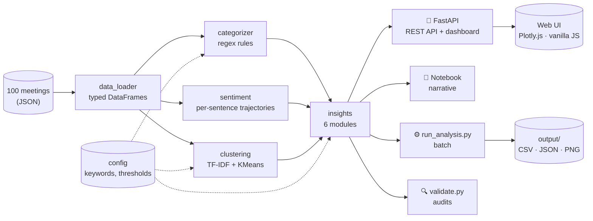

# Transcript Intelligence

> A production-ready pipeline that processes B2B meeting transcripts and surfaces topic categorization, sentiment trends, and strategic insights — exposed as a REST API with a lightweight web dashboard.

[](.github/workflows/ci.yml)
[](tests/)
[](pyproject.toml)
[](validate.py)
[](pyproject.toml)
[](LICENSE)

---

## Contents

- [What this does](#what-this-does)
- [Quick start](#quick-start)
- [Architecture](#architecture)
- [Project layout](#project-layout)
- [Key findings](#key-findings)
- [Testing & validation](#testing--validation)
- [API & web dashboard](#api--web-dashboard)
- [Production readiness](#production-readiness)
- [Documentation](#documentation)

---

## What this does

Given ~100 meeting transcripts (support cases, customer-facing calls, internal meetings), this pipeline:

1. **Categorizes** every meeting along three dimensions — call type, purpose, product area — using regex rules + TF-IDF clustering
2. **Analyzes sentiment** at meeting *and* sentence granularity, surfacing within-call friction moments invisible to summary-level scores
3. **Generates six strategic insights** — customer churn risk, incident blast radius, action item bottlenecks, competitive language, speaker dominance, within-meeting negative pivots

Five interfaces over the same `src/` analysis core:

| Interface | When to use |
|---|---|
| `transcript_intelligence.ipynb` | Reviewable narrative — the deliverable |
| `api/` (FastAPI + Plotly.js dashboard at `/`) | Live demo, drill-downs, production-grade |
| `run_analysis.py` | Batch / CI / scheduled refresh |
| `validate.py` | Semantic audits against the dataset |
| `docs/html/` | Standalone HTML docs (no server needed) |

## Quick start

```bash
make install-dev   # install + dev tools + pre-commit hooks
make test          # 71 tests across rules, sentiment, clusters, insights, API
make validate      # 10 semantic audits against the dataset
make dev           # FastAPI server with hot reload → http://127.0.0.1:8000
make docker-build  # containerized
make docs          # static HTML site at docs/html/
```

Without Make:

```bash
pip install -e ".[dev]"
pytest && python validate.py && python run_analysis.py
uvicorn api.main:app --reload
```

## Architecture



The four interfaces all import the same `src/` modules — single source of truth, no duplicated logic. See [`docs/ARCHITECTURE.md`](docs/ARCHITECTURE.md) for module dependency, data model, pipeline-stage diagrams.

## Project layout

```
transcript-intelligence/
├── pyproject.toml                # PEP 621 packaging, ruff, mypy, pytest, coverage
├── requirements.txt              # runtime deps (also installable via pyproject)
├── Makefile                      # common commands
├── Dockerfile                    # multi-stage, non-root, JSON logs, healthcheck
├── .dockerignore
├── .pre-commit-config.yaml       # ruff + mypy + standard hooks
├── .github/workflows/ci.yml      # lint · type-check · test (3.9/3.11/3.12) · docker build
├── run_analysis.py               # batch pipeline (logs via src.logging_config)
├── validate.py                   # semantic audits
├── build_docs.py                 # MD → HTML
├── transcript_intelligence.ipynb # narrative notebook
├── src/                          # analysis core (importable package)
│   ├── config.py                 # keyword maps, thresholds (single source of truth)
│   ├── data_loader.py            # raw JSON → typed DataFrames + dataclass
│   ├── categorizer.py            # call type / purpose / product / customer
│   ├── sentiment.py              # meeting + sentence-level trajectories
│   ├── clustering.py             # TF-IDF + KMeans, k via silhouette
│   ├── insights.py               # 6 strategic insights
│   ├── visualizations.py         # matplotlib (notebook + CLI)
│   └── logging_config.py         # structured logging (text or JSON)
├── api/                          # FastAPI service
│   ├── main.py                   # app, lifespan, static mount
│   ├── routes.py                 # /api/* endpoints, OpenAPI auto-docs
│   ├── models.py                 # Pydantic response schemas
│   └── state.py                  # cached pipeline (thread-safe singleton)
├── web/                          # static frontend (no build step)
│   ├── index.html
│   └── static/{app.js, style.css}
├── tests/                        # 71 tests, 94% coverage
│   ├── conftest.py               # session-scoped fixtures
│   ├── test_categorizer.py       # 31 rule tests
│   ├── test_data_loader.py       # 6 loader tests
│   ├── test_sentiment.py         # 8 trajectory tests
│   ├── test_clustering.py        # 3 clustering tests
│   ├── test_insights.py          # 9 insight tests
│   └── test_api.py               # 14 end-to-end API tests
├── docs/
│   ├── ARCHITECTURE.md           # system design with Mermaid diagrams
│   ├── APPROACH.md               # methodology decisions
│   └── html/                     # built static site (make docs)
└── output/                       # generated artifacts (gitignored)
```

## Key findings

| Area | Headline |
|---|---|
| Categorization | 100 meetings → 3 call types · 11 purposes · 4 product areas; **k=7** content clusters chosen by silhouette |
| Sentiment | Support 2.94 < internal 3.42 < external 3.71. Detect product 3.20 — outage drag |
| Outage impact | One incident touched **68% of all meetings**, dragged sentiment by **0.77 points** |
| Top at-risk customers | Northstar Pharma · Cobalt Software · Summit Trust |
| Execution bottleneck | Maria Santos owns 31 action items (most by far) |
| Conversation health | Support calls have **51% single-speaker dominance** — agents may be over-talking |
| Friction moments | **9 meetings** with sharp within-call sentiment drops (sentence-level analysis) |

## Testing & validation

Three complementary layers:

| Layer | Command | What it checks |
|---|---|---|
| **Unit + integration tests** | `make test` | 71 tests, 94% coverage. Categorizer, sentiment math, clustering, insights, end-to-end API |
| **Semantic validation** | `make validate` | 10 audits against the *actual data* — rule coverage, cross-references, distribution checks |
| **Lint + type-check** | `make lint && make type-check` | ruff (style + bugbear + simplify) + mypy |

```bash
$ make test
71 passed in 2.69s   ·   coverage: 94%

$ make validate
9 pass · 1 warn · 0 fail   (10 checks)
```

The remaining warning (cluster homogeneity) is a real finding — two clusters re-discover rule categories — not a defect.

## API & web dashboard

```bash
make dev   # http://127.0.0.1:8000
```

The web app at `/` consumes the same JSON endpoints any external client would. OpenAPI docs at `/docs`.

### Endpoints

| Endpoint | Purpose |
|---|---|
| `GET /api/health` | Liveness probe |
| `GET /api/summary` | Dataset KPIs, call type / purpose / product distributions |
| `GET /api/meetings?call_type=&product=&date_from=&date_to=&limit=` | Filtered meeting list |
| `GET /api/meetings/{id}` | Full meeting detail with per-sentence sentiment + trajectory |
| `GET /api/sentiment/{by-call-type, by-purpose, weekly, scores}` | Sentiment views |
| `GET /api/clusters` | Cluster sizes, top terms, dominant purposes |
| `GET /api/insights/customer-health` | Risk-ranked customer table |
| `GET /api/insights/customer/{name}` | Drill-down per customer |
| `GET /api/insights/incident-impact` | Outage blast radius |
| `GET /api/insights/action-items` | Top owners with per-channel breakdown |
| `GET /api/insights/competitive` | Competitive language flags |
| `GET /api/insights/speaker-dominance` | Talk-time imbalance |
| `GET /api/insights/negative-pivots` | Within-meeting friction moments |

### Why FastAPI instead of Streamlit

| Concern | Streamlit | FastAPI + static frontend |
|---|---|---|
| Multi-user / scale-out | Single session per process | Stateless, scales horizontally |
| API contract | None — UI-only | OpenAPI schema, versioned models |
| Testability | Hard to test the UI logic | `TestClient` covers every endpoint |
| Deployment | Streamlit-specific runtime | Standard ASGI / Docker / Kubernetes |
| Frontend flexibility | Streamlit components only | Any client (web, mobile, script, BI tool) |
| Bundle size | Heavy framework + runtime | One Python service, zero-build static UI |

## Production readiness

| Concern | How it's handled |
|---|---|
| **Packaging** | `pyproject.toml` (PEP 621); installable via `pip install -e ".[dev]"`; entry-point scripts |
| **Linting** | `ruff` (lint + format) configured in pyproject |
| **Type checking** | `mypy` configured for `src/` and `api/` |
| **Testing** | `pytest`, 71 tests, 94% coverage, session-scoped fixtures, FastAPI `TestClient` |
| **CI/CD** | GitHub Actions: lint → type-check → test (3.9/3.11/3.12) → Docker build |
| **Containerization** | Multi-stage Dockerfile, non-root user, healthcheck, JSON logs |
| **Observability** | Structured logging (`LOG_FORMAT=json`), `/api/health` endpoint |
| **Configuration** | Env vars (`LOG_LEVEL`, `LOG_FORMAT`, `PORT`); rules/thresholds in `src/config.py` |
| **API contracts** | Pydantic response models + OpenAPI auto-docs at `/docs` |
| **Caching** | Pipeline computed once at startup, cached in thread-safe singleton |
| **Pre-commit** | ruff + mypy + standard hooks (`pre-commit install`) |
| **Documentation** | README + 2 docs files with Mermaid diagrams + static HTML build |

### What's deliberately not done

- **Auth / multi-tenancy** — not in scope for a take-home; trivial to add via FastAPI dependencies
- **Database persistence** — dataset is static JSON; pipeline runs in 10s
- **Async I/O refactor** — not a bottleneck at this scale
- **Metrics / tracing** — over-engineering for a single-instance demo; OpenTelemetry would slot in cleanly

## Documentation

- [`docs/ARCHITECTURE.md`](docs/ARCHITECTURE.md) — system design, module dependencies, data model, pipeline stages, sequence diagrams
- [`docs/APPROACH.md`](docs/APPROACH.md) — methodology decisions, why hybrid categorization, why silhouette, sentiment trajectory math, risk scoring weights
- **`docs/html/`** — same content as standalone HTML files. `make docs` to build, `open docs/html/index.html` to view

## License

[MIT](LICENSE)
