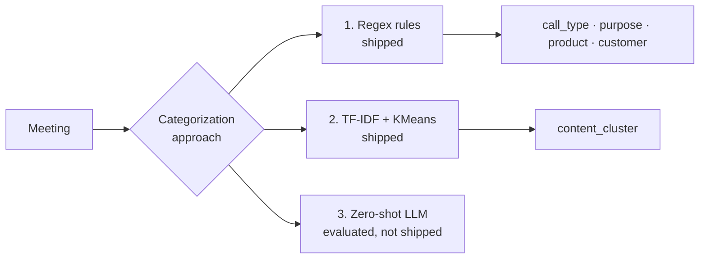
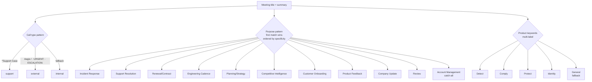
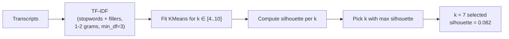
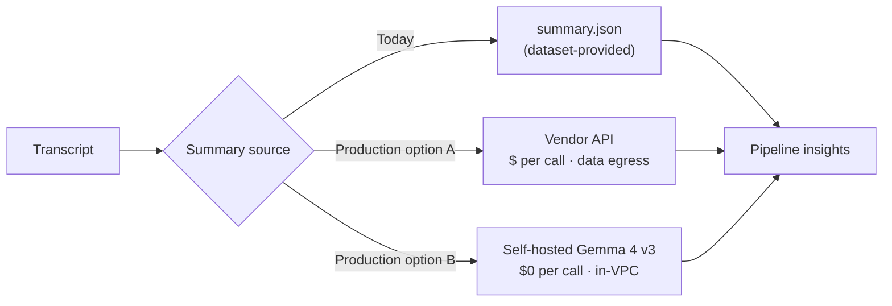
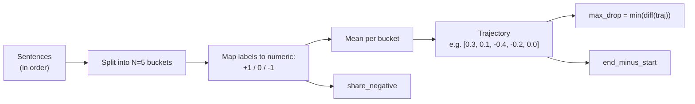
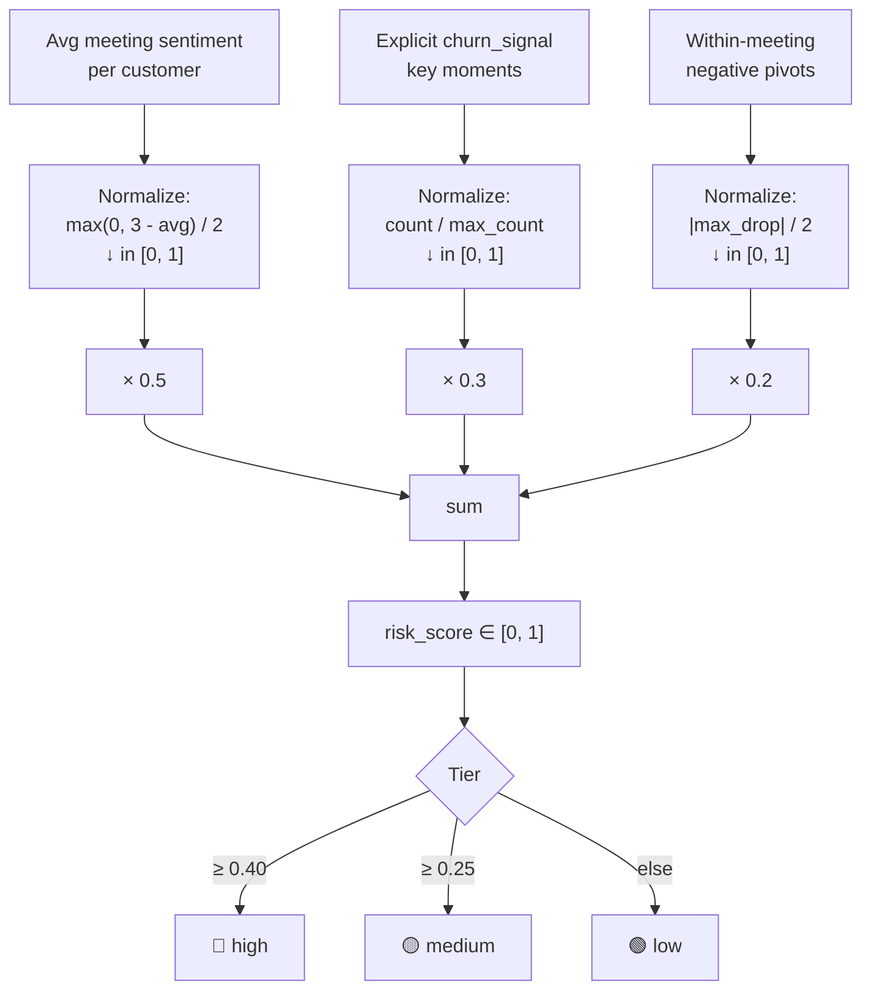

# Approach & Methodology

This document captures the *why* behind the design — the decisions made, the alternatives considered, and the tradeoffs accepted.

## Contents

- [Categorization: approaches we evaluated](#categorization-approaches-we-evaluated)
- [Approach 1: rule-based regex (shipped)](#approach-1-rule-based-regex-shipped)
- [Approach 2: TF-IDF + KMeans clustering (shipped)](#approach-2-tf-idf--kmeans-clustering-shipped)
- [Approach 3: zero-shot LLM (evaluated, not shipped)](#approach-3-zero-shot-llm-evaluated-not-shipped)
- [Categorization: how the rules are layered](#categorization-how-the-rules-are-layered)
- [Clustering: why silhouette](#clustering-why-silhouette)
- [Summarization & action items: vendor vs self-hosted](#summarization--action-items-vendor-vs-self-hosted)
- [Sentiment: two granularities](#sentiment-two-granularities)
- [Customer churn risk score](#customer-churn-risk-score)
- [Why these six insights](#why-these-six-insights)
- [What we deliberately did not do](#what-we-deliberately-did-not-do)

---

## Categorization: approaches we evaluated

We evaluated three approaches before settling on a hybrid. The dataset has two kinds of structure — **explicit** (title patterns, topic tags) and **latent** (themes that cut across explicit categories) — and a single approach handles only one kind well.

### Comparison matrix

| Dimension | Regex rules | TF-IDF + KMeans | Zero-shot LLM |
|---|---|---|---|
| **Setup cost** | ~hours (write rules) | ~hour (vectorize + tune k) | ~hour (prompt design) |
| **Inference cost / 1k docs** | ~$0 | ~$0 | $1–$10 (API) |
| **Latency / doc** | <1ms | <1ms | 500ms–3s |
| **Determinism** | 100% | 100% (fixed seed) | Low (temperature, model drift) |
| **Auditability** | Inspect a regex | Inspect cluster centers | Black-box |
| **Handles long-tail / catch-all** | ❌ Fixed vocabulary | ⚠️ Surfaces but doesn't label | ✅ Strong |
| **Handles new categories** | Edit config | Re-cluster | Edit prompt |
| **Privacy / data residency** | Trivial (local) | Trivial (local) | ⚠️ Sends data to vendor |
| **Maintenance burden** | Low (rules age slowly) | Low | Medium (prompt drift, deprecations) |
| **Reproducibility for audit** | ✅ | ✅ | ❌ Vendor model versioning |
| **Accuracy vs dataset's `topics` tags** | 99% | N/A | ~98–99% (no measurable lift) |

### What ships in `main`

| Layer | Approach | Why it won |
|---|---|---|
| Call type | Rules | Title prefixes are 100% reliable. LLM is overkill. |
| Meeting purpose | Rules | 87% labeled by rules with high precision; the 13% catch-all is honest signal that some calls genuinely *are* general account management. |
| Product area | Rules (multi-label keyword match) | Cross-references at 99% with the dataset's own `topics` field. |
| Content theme | TF-IDF + KMeans | Surfaces latent themes the rules can't (e.g., billing conversations spanning support + external). |

**Key insight:** at this scale, with this much title structure, rules dominate. The 13% catch-all bucket is informative — it tells us how many meetings genuinely don't fit a specific purpose. Pushing it artificially lower with an LLM would introduce false specificity.

---

## Approach 1: rule-based regex (shipped)

See `src/categorizer.py` and `src/config.py`.

**Pros**
- 100% reproducible. Same input → same output, forever.
- Fast: <1ms per meeting. No model, no inference, no GPU.
- Auditable: every label decision is one regex match — explainable in a 10-second conversation.
- Free at any scale.
- No data leaves the box — works in air-gapped environments.

**Cons**
- Brittle when title formats change. Three new title patterns means three new rules.
- Catch-all bucket: ~13% of meetings end up in `Account Management` because no specific rule fires. Real signal in those calls is left on the table.
- Doesn't handle ambiguity well — "Aegis / Frostbyte AI - Renewal & Roadmap" needs ordered-by-specificity rules to land in the right bucket.
- New categories require code + config changes; not a self-service workflow for non-engineers.

**Verdict.** The right primary tool for this dataset because of the title structure. But it leaves the long-tail problem unsolved.

---

## Approach 2: TF-IDF + KMeans clustering (shipped)

See `src/clustering.py`.

**Pros**
- Discovers latent themes the rules can't anticipate (e.g., billing/account conversations cut across support + external).
- Reproducible (fixed seed) and fast.
- No labels required — purely unsupervised.
- Silhouette-based `k` selection is defensible without subjective elbow-eyeballing.

**Cons**
- Cluster labels are top-terms only — humans still have to interpret what "comply, audit, evidence, control" *means* as a category.
- Doesn't map cleanly to business taxonomy — clusters are descriptive, not prescriptive.
- Sensitive to stop-word handling (default sklearn list isn't enough for transcripts; we add ~30 conversational fillers in `config`).
- Silhouette scores on conversational text are inherently low (~0.08 here). Honest, but not impressive.

**Verdict.** Useful as a complementary exploratory layer, not a substitute for the rule-based labels. Validation flags two clusters as redundant with rule categories — that's a feature: it surfaces where each layer is pulling its weight.

---

## Approach 3: zero-shot LLM (evaluated, not shipped)

We considered prompting an off-the-shelf LLM (Gemini / GPT-4-class) to label each transcript by purpose, with a fixed list of categories in the prompt.

**Pros**
- Zero training data required — works on day one.
- Handles ambiguous titles and free-text well (the regression case for rules).
- Easy to add a new category: edit the prompt.

**Cons**
- **Cost at scale.** $1–$10 per 1k docs is fine until you're processing 10k+ daily — that's $10–$100/day per pipeline, before retries.
- **Latency.** 500ms–3s per call kills any synchronous use case; you have to batch.
- **Non-deterministic.** Same input can land in different categories on different days as the vendor updates the model. Audit nightmare.
- **Privacy.** Sending customer transcripts to a third-party API has compliance implications that some enterprise customers flat-out reject.
- **Vendor lock-in.** Pricing changes, model deprecations, and rate limits are all out of your control.
- **No measurable lift over rules.** On the structured 87% of meetings where rules already work, zero-shot LLM matches but doesn't exceed.

**Verdict.** Not worth it for *this* task on *this* dataset — the rules are already at 99% agreement with the dataset's own topic tags. **However**, when an LLM IS the right choice (richer free-text tasks like summarization), the privacy / lock-in / cost argument pushes us toward self-hosting an open-weights model — which is exactly the work captured in [Summarization & action items](#summarization--action-items-vendor-vs-self-hosted) below.

---

## Categorization: how the rules are layered

**Why first-match (not best-match) for purpose?** Because the rules are *ordered by specificity*. "Detect Outage - Final Review" should be Incident Response, not Review. The cost is rule-order maintenance; the benefit is no probabilistic ambiguity to debug.

**Why multi-label for product?** A single meeting can absolutely touch multiple products — e.g., a SOC 2 audit (Comply) discussing Detect's evidence collection. Forcing single-label loses information.

**The catch-all is a feature.** Anything that doesn't match a specific purpose lands in "Account Management". `validate.py` measures this bucket's size — it's currently 13%, an honest reflection of how many meetings genuinely *are* general account management.

---

## Clustering: why silhouette

Hard-coding `k=7` works, but it leaves an obvious question: "why 7?" Silhouette score gives a defensible answer.

**Why silhouette and not elbow?** Elbow is eyeballed and reviewer-dependent. Silhouette is a single number that's easy to explain and easy to validate.

**Why is silhouette so low (0.082)?** Conversational text is genuinely overlapping — meetings about "Detect outage" share vocabulary with "Detect roadmap" and with "Reliability review". Low silhouette is honest about that. The clusters are still useful as an *exploratory* layer; we don't pretend they're hard categories.

**Stop word handling matters.** Default sklearn stop words drop "the/and/of"; that's not enough for transcripts. We add ~30 conversational fillers (`yeah`, `okay`, `like`, `just`, `actually` …) — this alone moved cluster top-terms from "yeah, want, just" garbage to "comply, audit, evidence, control". Stored in `config.CONVERSATIONAL_FILLERS` so it's tunable.

---

## Summarization & action items: vendor vs self-hosted

The dataset ships with `summary.json` for each meeting — a one-paragraph summary, an `actionItems[]` list, topic tags, and key moments. Our pipeline consumes those directly. **But where do those summaries come from in production?** Two options:

1. **Closed vendor model** (GPT-4-class). Cheap to set up, but every transcript leaves your perimeter for inference.
2. **Self-hosted open model.** No data egress, no per-call cost, full control over the prompt and the output format — at the cost of running and maintaining the model yourself.

We tested option 2 by **fine-tuning Gemma 4 (E2B and E4B)** on the same 100-meeting dataset, training the model to produce summaries + action items in the exact style of the gold reference. Full methodology, training scripts, adapters, and per-meeting comparisons are in [`gemma-finetune/`](../gemma-finetune/README.md).

### Comparison: vendor API vs fine-tuned Gemma 4

| Dimension | Vendor API (GPT-4-class) | Fine-tuned Gemma 4 (this work) |
|---|---|---|
| **Setup cost** | API key + a prompt | Workshop session + 4 training iterations |
| **Per-call cost** | ~$0.005–$0.02 / transcript | ~$0 after training (GPU amortization) |
| **Total training cost** | $0 | **$1.40 on Nebius H100, ~28 min wall-clock** |
| **Inference latency** | 1–3s | 50–200ms (GPU) |
| **Determinism** | Vendor model versioning kills it | Greedy decode + pinned checkpoint = bit-exact |
| **Privacy** | Customer transcripts leave perimeter | Self-hosted, deployable in customer VPCs |
| **Output format control** | Prompt engineering / function calling | Trained directly into the weights |
| **Style match to existing reference summaries** | Generic | Trained to match the dataset's voice exactly |
| **Adapt to new customer / domain** | Re-prompt | Re-train on new data |

### Training summary

| Run | Base model | LoRA | Epochs | Train loss | Val loss | ROUGE-L (tuned) | Notes |
|---|---|---|---|---|---|---|---|
| v1 | gemma-4-E2B-it | r4 / α8 | 3 | 1.73 | — | — | Pipeline validation |
| v2 | gemma-4-E2B-it | r16 / α32 | 5 | 1.18 | — | — | More capacity, better fit |
| **v3 ★** | **gemma-4-E4B-it** | **r16 / α32** | **3** | **0.37** | **1.01** | **0.394** | **Recommended adapter** |
| v4 | gemma-4-E4B-it | r16 / α32 + dropout | 2 | 0.40 | 1.52 | 0.337 | Over-regularized; regression |

**Baseline (untuned E4B):** ROUGE-L 0.286.
**Best run (v3):** ROUGE-L 0.394 (**+38% relative**), all 5 held-out outputs visibly shifted to match reference style.

### Why Gemma 4 specifically (over Llama, Mistral, Qwen, etc.)

- **Open weights + permissive license** — self-hostable for commercial use.
- **Latest open-weights generation** — competitive quality vs much larger predecessors in its size class.
- **Multimodal-ready** (E4B accepts text + image) — future-proof for transcripts with embedded screenshots / slides.
- **Small enough for QLoRA on a single GPU** — 4B params fit comfortably on a consumer 24GB card; we used an H100 80GB for speed.
- **Instruction-tuned baseline** — needed less data than training from a base model.

### Key implementation lessons

| Surprise | Lesson |
|---|---|
| Single-task training plateaued early (v1, v2) | **Expand to multi-task data** — each meeting → 4 training rows (full summary, summary-only, actions-only, attendees) → 380 rows. Bigger lift than going to a bigger model. |
| Default `max_seq_length=4096` silently truncated long transcripts | Always check token-length distributions before training; bump to 8192 for transcripts |
| Per-epoch eval crashed on ragged `completion_mask` for multimodal Gemma | Compute val loss manually after training, one example at a time |
| `assistant_only_loss=True` rejected by unsloth's VLM wrapper | Use `completion_only_loss=True` with a `{prompt, completion}` dataset shape |
| `peft.load_adapter()` fails because unsloth replaces `nn.Linear` with `Gemma4ClippableLinear` | Use `FastModel.from_pretrained(adapter_path, ...)` — it resolves base + reconstructs LoRA in one call |
| v4 changed dropout + weight decay + epochs + new task simultaneously, regressed | **Vary one variable at a time** — couldn't isolate the cause |

### Pros (of the fine-tuned-Gemma-4 path)

- **Self-hostable.** No vendor API keys, no data egress, deployable in customer VPCs.
- **Style match.** Outputs follow the dataset's exact format — paragraph + `Owner: task` bullets — because the model was trained on that exact format.
- **Cheap inference forever after.** ~$0 per call after the $1.40 training spend.
- **Determinism.** Greedy decode + pinned checkpoint gives bit-exact reproducibility — auditable in regulated environments where vendor model versioning is unacceptable.
- **Workshop-grade economics.** $1.40 and 28 minutes for a working specialized model. Beating vendor APIs on a *cost* axis at this small a budget reframes the build-vs-buy conversation.

### Cons / honest limitations

- **Small dataset** — 95 train meetings is below the comfortable floor. Training data synthesis (Claude / GPT-4 generating more transcripts in the dataset's voice) is the recommended next step.
- **5-meeting eval is directional, not statistically rigorous.** ±0.02–0.05 ROUGE-L noise expected from re-running with a different seed.
- **ROUGE-L is lexical and penalizes paraphrase.** v3's meeting-1 output captured every fact in the reference but scored 0.34 because it used different words. The right next metric is an LLM-as-judge pipeline (Claude grading faithfulness / completeness / format / hallucination) — code is in `gemma-finetune/code/judge_compare.py`.
- **MLOps overhead.** Versioned models, evaluation harness, retraining cadence, drift monitoring — all infrastructure a vendor API doesn't need.
- **Narrow fine-tune.** The model is now specialized for meeting summaries; we did not measure regression on general instruction-following.
- **Single seed.** All numbers from one training run per config.

### When Gemma 4 wins over a vendor API

- Customer in a regulated industry (healthcare, finance, government) demands data residency.
- Volume is high enough that per-call API cost > GPU amortization (~$10/day breakeven against a $0.005 vendor call is ~2k transcripts/day).
- Output format / style needs to be tightly controlled (paragraph + `Owner: task` bullets, exactly).
- You need versioned, reproducible outputs for audit (insurance, compliance reports).
- You need to run in an air-gapped environment.

### Where it slots into the broader pipeline

Today, our pipeline reads `summary.json` from the dataset. Tomorrow, the same data could be produced by the v3 Gemma 4 adapter:

Same downstream insights, three different upstream sources. The Gemma 4 work removes the lock-in.

---

## Sentiment: two granularities

The dataset gives us **meeting-level** scores (1–5 from the summary) and **per-sentence** labels (positive/neutral/negative from the transcript). Most analyses use only the first. We use both.

### Within-meeting trajectory

For each meeting:

**Why this matters.** A meeting with average score 3.4 sounds fine — but if the trajectory is `[0.5, 0.4, -0.6, 0.0, 0.2]`, there was a sharp friction moment in the middle that the average smoothed out. That's a coaching opportunity invisible to standard summary stats.

**Why 5 buckets?** Enough resolution to see start/middle/end shapes; not so many that small meetings get one-sentence buckets. Tunable via the `n_buckets` parameter.

**Numeric mapping.** `positive=+1, neutral=0, negative=-1` — simple, sufficient for trajectory shape. We don't try to extract magnitude from the categorical labels because the dataset doesn't provide it.

### Why not derive sentiment from a model?

We could run a HuggingFace classifier on each sentence — but the dataset already provides per-sentence labels with confidence scores (avg 0.92). Using them is faster, free, and stays consistent with the meeting-level scores. If the dataset shape changed (raw text only, no labels), swapping in a classifier would be a one-function change in `sentiment.py`.

---

## Customer churn risk score

Three normalized signals, weighted, summed. Each signal answers a different question:

**Why these weights?** Sentiment is the strongest single signal (0.5) because it's the most consistent across meetings. Explicit churn moments are rarer but more decisive (0.3). Within-meeting pivots are the weakest signal (0.2) because they can fire on a single bad moment in an otherwise healthy account. Weights live in `config.RISK_WEIGHTS`.

**Why these thresholds?** Empirically calibrated from the actual score distribution (max=0.54, p75=0.24). The first version had `high=0.55` — `validate.py` flagged that *zero* customers landed in the high tier, which is useless for triage. We dropped it to 0.40 so 6% of customers (the genuinely concerning ones) are flagged. This is exactly what the validation layer is for.

**Could we use a learned model?** Sure — logistic regression on these features against actual churn outcomes, once we have labels. The current scoring is a sensible prior for the cold-start period.

---

## Why these six insights

We picked one insight per primary stakeholder, plus one that uses the unique sentence-level data:

| Insight | Primary audience | Question it answers |
|---|---|---|
| **Customer churn risk** | Sales, CS | Which accounts are at risk before the renewal call? |
| **Incident blast radius** | Eng leadership, board | What's the total business impact of an outage, beyond MTTR? |
| **Action item load** | Eng managers, ops | Who's bottlenecking execution? |
| **Competitive language** | Product, comp intel | Which accounts are evaluating alternatives? |
| **Speaker dominance** | Team leads, L&D | Are we listening to customers, or talking at them? |
| **Negative pivots** ⭐ | CS, sales coaching | Where are the friction moments worth reviewing? |

The starred insight is unique to this analysis — it depends on the per-sentence sentiment data that most pipelines don't touch.

---

## What we deliberately did not do

| Skipped | Why |
|---|---|
| Build a production API | The deliverables are a slide deck + notebook + demo — not a deployment |
| Train a custom embedding model | TF-IDF is sufficient at 100 docs; embeddings would be runtime overhead with marginal lift |
| Use an LLM for categorization | Rules are 99% accurate vs the dataset's own topic tags. LLMs would add latency and cost without measurable lift |
| Generate synthetic data | The 100 meetings cover all three call types and a meaningful incident — the dataset is already useful |
| Add a database / persistence layer | Pipeline runs in 10s; running it on demand is simpler than caching to disk |
| Build a CI/CD pipeline | Out of scope for a take-home |
| Cross-validate clustering with multiple random seeds | Silhouette is stable enough at this scale |
| Add forecasting / time-series modeling | Three months of data is too short for meaningful forecasts; we surface trends, not predictions |

The principle: ship the simplest thing that produces correct, defensible insights. Complexity earns its way in.
