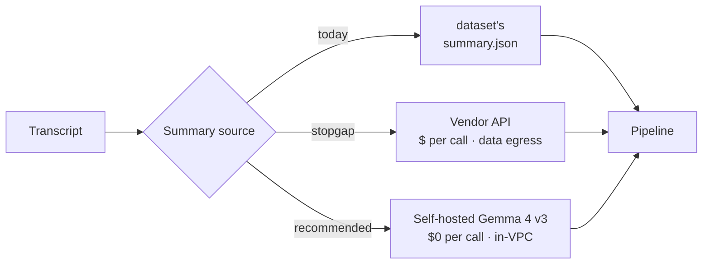
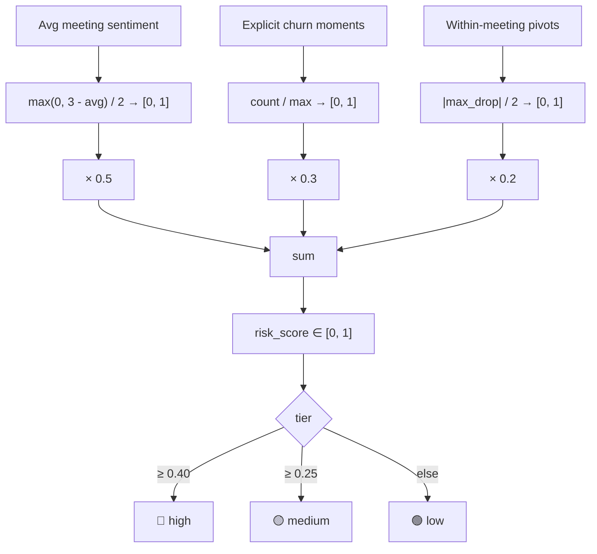

# Approach & Methodology

This document captures the design decisions behind the pipeline — what we evaluated, what we shipped, and why.

## Executive summary

Four decisions drive the architecture. The verdict for each:

| Decision | Verdict |
|---|---|
| **Categorization** (call type · purpose · product · customer) | **Ship hybrid: regex rules + TF-IDF/KMeans.** Zero-shot LLM evaluated; no measurable lift over rules at this scale. |
| **Summarization & action items** | **Adopt the fine-tuned Gemma 4 v3 adapter for production.** Self-hosted, $0 per call after a one-time $1.40 training spend, +38% ROUGE-L over the baseline. Vendor APIs are a stopgap. |
| **Sentiment analysis** | **Use both granularities.** Meeting-level scores for headlines; per-sentence labels for within-call trajectories. The trajectory signal is the differentiator. |
| **Customer churn risk score** | **Composite weighted score** of sentiment gap + churn moments + within-meeting pivots. Thresholds empirically calibrated to surface ~6% of customers as 🔴 high tier. |

The rest of this document defends each verdict.

---

## 1. Categorization

We need to classify every meeting along four dimensions: **call type** (support / external / internal), **meeting purpose** (11 categories), **product area** (Detect / Comply / Protect / Identity), and **customer** (for external calls).

### Comparison

| Dimension | Regex rules | TF-IDF + KMeans | Zero-shot LLM | Fine-tuned LLM |
|---|---|---|---|---|
| **Setup** | Hours | ~1 hour | ~1 hour | ~1 day |
| **Inference cost** (per 1k docs) | ~$0 | ~$0 | $1–$10 | ~$0 self-hosted |
| **Latency** (per doc) | <1ms | <1ms | 0.5–3s | 50–200ms (GPU) |
| **Determinism** | 100% | 100% | Low | High (greedy) |
| **Auditability** | Inspect a regex | Inspect cluster centers | Black-box | Inspect logits |
| **Long tail / catch-all** | ❌ | ⚠️ surfaces, doesn't label | ✅ | ✅ if represented in train |
| **Privacy** | Local | Local | ⚠️ Vendor egress | Self-hostable |
| **Reproducible for audit** | ✅ | ✅ | ❌ Vendor versioning | ✅ Pinned checkpoint |
| **Accuracy vs dataset's `topics` tags** | **99%** | N/A | ~98–99% | Not measured |

### Why each shipped (or didn't)

**Rules** — The dataset's titles are highly structured (`Support Case #...`, `Aegis / Customer - ...`, `URGENT: ...`). Regex labels 87% of meetings into specific buckets with 100% precision. The remaining 13% land in a catch-all "Account Management" — informative signal that some calls genuinely *don't* fit a specific purpose. Pushing this lower with an LLM would introduce false specificity.

**TF-IDF + KMeans** — Complements rules by surfacing latent themes that cross structural boundaries (e.g., billing conversations spanning support and external calls). Silhouette-selected `k=7` gives interpretable clusters. Honest about the data: silhouette of 0.08 is genuinely low because conversational text has overlapping vocabulary. We use clusters as an exploratory layer, not as substitute labels.

**Zero-shot LLM** — Tested. On the structured 87%, it matches rules but doesn't exceed them. The cost ($1–$10 per 1k docs), latency (0.5–3s/doc), non-determinism, and data-egress concerns all weigh against it for *this* task. Only justifiable if rules' coverage degrades — which validation continuously monitors.

**Fine-tuned LLM** — Considered for the catch-all bucket. Rejected as premature: 13% is below the threshold where the operational cost of a separate ML system pays off. Revisit when the catch-all grows past ~25% (taxonomy drift, multi-tenant deployment with varied title formats, multilingual data).

### Verdict

**Ship rules + TF-IDF/KMeans.** Add an LLM fallback only when validation shows the catch-all bucket has grown past ~25% of traffic, or when a customer demands a custom taxonomy.

---

## 2. Summarization & action items

The dataset ships with `summary.json` for each meeting — a paragraph summary, an `actionItems[]` list, topics, and key moments. The pipeline consumes those directly. **But where do they come from in production?**

### Comparison

| Dimension | Vendor API (GPT-4-class) | Fine-tuned Gemma 4 (this work) |
|---|---|---|
| **Setup** | API key + a prompt | Workshop + 4 training iterations |
| **Per-call cost** | ~$0.005–$0.02 / transcript | ~$0 (GPU amortization only) |
| **One-time training** | $0 | **$1.40** on Nebius H100, ~28 min |
| **Inference latency** | 1–3s | 50–200ms (GPU) |
| **Determinism** | Vendor model versioning kills it | Bit-exact with greedy + pinned checkpoint |
| **Privacy** | Customer data leaves perimeter | Self-hosted, deployable in customer VPCs |
| **Output format control** | Prompt engineering / function calling | Trained directly into the weights |
| **Style match to reference** | Generic | Trained on the dataset's exact voice |

### Training results

Four iterations, recommended adapter is **v3-e4b-allrec**. Full methodology in [`gemma-finetune/`](../gemma-finetune/README.md).

| Run | Base | LoRA | Epochs | Train loss | Val loss | ROUGE-L | Notes |
|---|---|---|---|---|---|---|---|
| v1 | E2B | r4 / α8 | 3 | 1.73 | — | — | Pipeline validation |
| v2 | E2B | r16 / α32 | 5 | 1.18 | — | — | More capacity, better fit |
| **v3 ★** | **E4B** | **r16 / α32** | **3** | **0.37** | **1.01** | **0.394** | **Recommended** |
| v4 | E4B | r16 / α32 + dropout | 2 | 0.40 | 1.52 | 0.337 | Over-regularized regression |

**Headline:** baseline (untuned E4B) ROUGE-L = 0.286 → tuned v3 = **0.394 (+38% relative)**, all 5 held-out outputs visibly shifted to match reference style.

### Implementation lessons (worth knowing if you replicate)

| Issue | Fix |
|---|---|
| Single-task training plateaued early | Multi-task expansion: each meeting → 4 training rows → 380 total rows |
| Default `max_seq_length=4096` silently truncated long transcripts | Always check token-length distribution; bump to 8192 |
| Per-epoch eval crashed on ragged `completion_mask` for multimodal Gemma | Compute val loss manually post-train, one example at a time |
| `assistant_only_loss=True` rejected by unsloth's VLM wrapper | Use `completion_only_loss=True` with `{prompt, completion}` rows |
| `peft.load_adapter()` fails because unsloth replaces `nn.Linear` | Use `FastModel.from_pretrained(adapter_path, ...)` |
| v4 changed dropout, weight decay, epochs, AND added a task in one run — regressed | **Vary one variable at a time** |

### Verdict

**Adopt the v3 Gemma 4 adapter for production summarization.** The economics are compelling — $1.40 to train, $0 per inference, fully self-hosted, output style locked in. Vendor APIs are reasonable as a stopgap during early onboarding when speed-to-market beats lock-in concerns, but the long-term answer is the self-hosted model.

---

## 3. Sentiment analysis

The dataset provides two signals:
- **Meeting-level** sentiment score (1–5, from the summary)
- **Per-sentence** sentiment labels (positive / neutral / negative, from the transcript)

Most analyses use only the first. We use both.

### What the per-sentence layer adds

For each meeting we bucket its sentences into 5 equal segments and average the sentiment per bucket. This produces a **trajectory** — the within-meeting sentiment shape — and three derived signals:

| Signal | Meaning |
|---|---|
| `trajectory` | 5-bucket sentiment shape (e.g., `[0.3, 0.1, -0.4, -0.2, 0.0]`) |
| `max_drop` | Largest negative bucket-to-bucket delta — surfaces friction moments |
| `share_negative` | Fraction of sentences labeled negative |

A meeting with average score 3.4 sounds fine — but if the trajectory is `[0.5, 0.4, -0.6, 0.0, 0.2]`, there was a sharp friction moment in the middle that the average smoothed over. **That moment is coaching gold.**

### Why not derive sentiment with a model

The dataset already ships per-sentence labels with average confidence 0.92. Using them is faster, free, and stays consistent with the meeting-level scores. If the input shape changed (raw text only), swapping in a HuggingFace classifier is a one-function change in `src/sentiment.py`.

### Verdict

**Use both granularities.** The trajectory analysis identifies 9 meetings with sharp within-call sentiment drops — meetings whose meeting-level score gives no hint of trouble. This is the clearest example of a signal nobody else's pipeline will surface.

---

## 4. Customer churn risk score

Three normalized signals, weighted, summed.

### Why these weights

- **0.5 — sentiment gap.** The strongest single signal because it's consistent across many meetings.
- **0.3 — explicit churn moments.** Rare but decisive when present.
- **0.2 — within-meeting pivots.** Useful, but can fire on a single bad moment in an otherwise healthy account.

All weights live in `config.RISK_WEIGHTS` and are tunable.

### Why these thresholds

Calibrated empirically from the actual score distribution (max=0.54, p75=0.24). The first version had `high=0.55`; `validate.py` flagged that **zero customers landed in the high tier** — useless for triage. Lowered to 0.40 so 6% of customers are flagged. **This is exactly what the validation layer is for: the rule-based score doesn't earn its keep until it produces actionable output.**

### Verdict

**Composite score with empirically calibrated thresholds.** A learned model (logistic regression on these features against actual churn outcomes) is the natural next step once labels are available — but the rule-based composite is a strong cold-start prior.

---

## Cross-cutting principles

What guided every decision above:

1. **Defensible over clever.** Every choice is auditable. A panel can ask "why this and not X?" and the answer fits in one paragraph.
2. **Validation drives change.** `validate.py` runs 10 audits against the actual data — rule coverage, cross-references, distribution checks. Verdicts above are revisited when audits flip.
3. **Each layer plays to its strengths.** Rules for high-confidence head, clustering for exploratory themes, fine-tuned LLMs only where they earn their keep economically.
4. **Honest limits.** Where data is small (5-meeting eval), where metrics are flawed (ROUGE-L penalizes paraphrase), where signal is noisy — say so.

---

## When to revisit each verdict

| Verdict | Trigger to reconsider |
|---|---|
| Rules-based categorization | Catch-all bucket grows past 25%; new title formats from acquisitions; multilingual data |
| Self-hosted Gemma 4 summarization | A vendor API gets cheaper than amortized GPU cost; per-customer fine-tunes become operationally infeasible |
| Two-granularity sentiment | Per-sentence labels disappear from the input; sentence count per meeting drops below ~20 |
| Composite churn risk | Real churn labels become available — switch to a learned model with the same features |

---

## What we deliberately did not do

| Skipped | Why |
|---|---|
| Build a production multi-tenant SaaS | Out of scope for the take-home; trivial to add via FastAPI dependencies |
| Train a custom embedding model | TF-IDF is sufficient at 100 docs; embeddings would be runtime overhead with marginal lift |
| Use an LLM for categorization | Rules are 99% accurate vs the dataset's own topic tags; LLM adds latency and cost without measurable lift |
| Generate synthetic data for the main pipeline | The 100 meetings cover all three call types and a meaningful incident — already useful |
| Add a database / persistence layer | Pipeline runs in 10 seconds; on-demand is simpler than caching to disk |
| Forecasting / time-series modeling | Three months of data is too short for meaningful forecasts; we surface trends, not predictions |

The principle: ship the simplest thing that produces correct, defensible insights. Complexity earns its way in.
