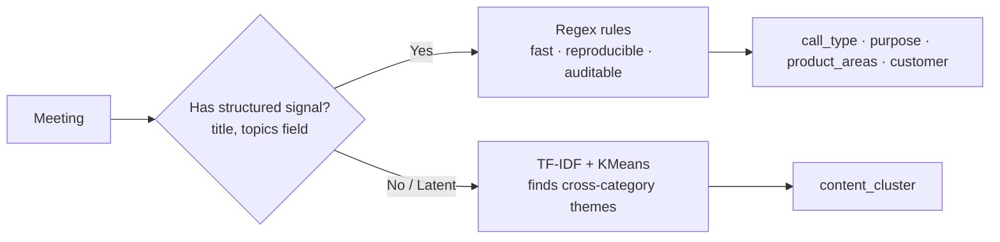
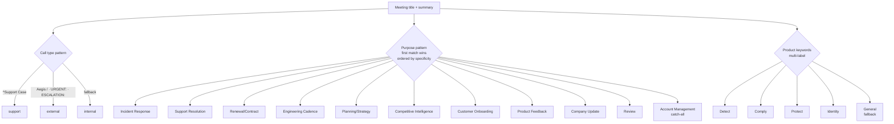
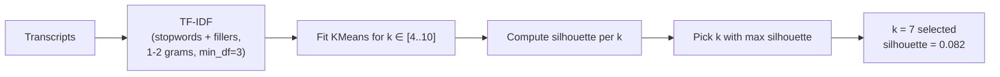
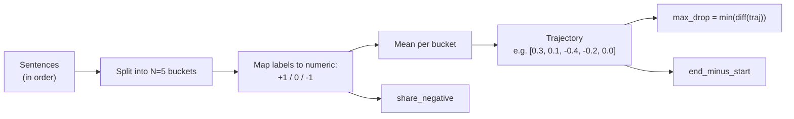
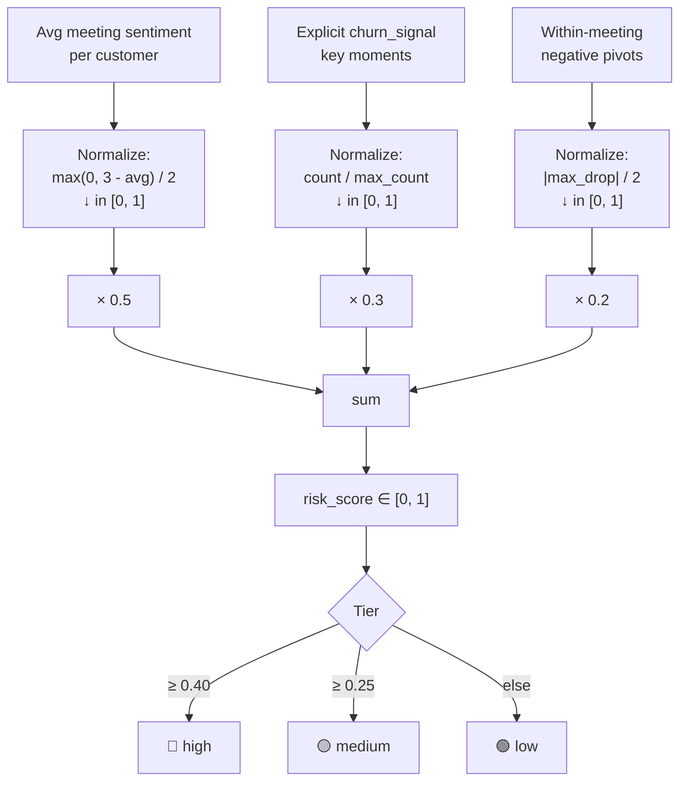

# Approach & Methodology

This document captures the *why* behind the design — the decisions made, the alternatives considered, and the tradeoffs accepted.

## Contents

- [Categorization: why hybrid](#categorization-why-hybrid)
- [Categorization: how the rules are layered](#categorization-how-the-rules-are-layered)
- [Clustering: why silhouette](#clustering-why-silhouette)
- [Sentiment: two granularities](#sentiment-two-granularities)
- [Customer churn risk score](#customer-churn-risk-score)
- [Why these six insights](#why-these-six-insights)
- [What we deliberately did not do](#what-we-deliberately-did-not-do)

---

## Categorization: why hybrid

The dataset has two kinds of structure: **explicit** (title patterns, topic tags) and **latent** (themes that cut across the explicit categories). A single approach handles only one kind well.

| Approach | Pros | Cons | Used for |
|---|---|---|---|
| **Pure rules** | 100% reproducible, fast, auditable, free | Misses latent themes; brittle on new title formats | Call type, purpose, product, customer |
| **Pure LLM** | Handles ambiguity well, no engineering | Slow, expensive, non-deterministic, opaque | — (overkill at this scale) |
| **Pure clustering** | Finds latent themes | Hard to label, no obvious mapping to business categories | — |
| **Hybrid (this)** | Each layer doing what it's good at | Two systems to maintain | ✅ |

**At what scale would I switch?** Pure-LLM becomes the right tool around 10k+ docs *or* when the title format becomes inconsistent (free-text titles, multilingual data, no structured fields). Below that, rules win on cost and reproducibility — and you can always layer an LLM on top of the catch-all bucket later.

---

## Categorization: how the rules are layered

**Why first-match (not best-match) for purpose?** Because the rules are *ordered by specificity*. "Detect Outage - Final Review" should be Incident Response, not Review. The cost is rule-order maintenance; the benefit is no probabilistic ambiguity to debug.

**Why multi-label for product?** A single meeting can absolutely touch multiple products — e.g., a SOC 2 audit (Comply) discussing Detect's evidence collection. Forcing single-label loses information.

**The catch-all is a feature.** Anything that doesn't match a specific purpose lands in "Account Management". `validate.py` measures this bucket's size — it's currently 13%, an honest reflection of how many meetings genuinely *are* general account management.

---

## Clustering: why silhouette

Hard-coding `k=7` works, but it leaves an obvious question: "why 7?" Silhouette score gives a defensible answer.

**Why silhouette and not elbow?** Elbow is eyeballed and reviewer-dependent. Silhouette is a single number that's easy to explain and easy to validate.

**Why is silhouette so low (0.082)?** Conversational text is genuinely overlapping — meetings about "Detect outage" share vocabulary with "Detect roadmap" and with "Reliability review". Low silhouette is honest about that. The clusters are still useful as an *exploratory* layer; we don't pretend they're hard categories.

**Stop word handling matters.** Default sklearn stop words drop "the/and/of"; that's not enough for transcripts. We add ~30 conversational fillers (`yeah`, `okay`, `like`, `just`, `actually` …) — this alone moved cluster top-terms from "yeah, want, just" garbage to "comply, audit, evidence, control". Stored in `config.CONVERSATIONAL_FILLERS` so it's tunable.

---

## Sentiment: two granularities

The dataset gives us **meeting-level** scores (1–5 from the summary) and **per-sentence** labels (positive/neutral/negative from the transcript). Most analyses use only the first. We use both.

### Within-meeting trajectory

For each meeting:

**Why this matters.** A meeting with average score 3.4 sounds fine — but if the trajectory is `[0.5, 0.4, -0.6, 0.0, 0.2]`, there was a sharp friction moment in the middle that the average smoothed out. That's a coaching opportunity invisible to standard summary stats.

**Why 5 buckets?** Enough resolution to see start/middle/end shapes; not so many that small meetings get one-sentence buckets. Tunable via the `n_buckets` parameter.

**Numeric mapping.** `positive=+1, neutral=0, negative=-1` — simple, sufficient for trajectory shape. We don't try to extract magnitude from the categorical labels because the dataset doesn't provide it.

### Why not derive sentiment from a model?

We could run a HuggingFace classifier on each sentence — but the dataset already provides per-sentence labels with confidence scores (avg 0.92). Using them is faster, free, and stays consistent with the meeting-level scores. If the dataset shape changed (raw text only, no labels), swapping in a classifier would be a one-function change in `sentiment.py`.

---

## Customer churn risk score

Three normalized signals, weighted, summed. Each signal answers a different question:

**Why these weights?** Sentiment is the strongest single signal (0.5) because it's the most consistent across meetings. Explicit churn moments are rarer but more decisive (0.3). Within-meeting pivots are the weakest signal (0.2) because they can fire on a single bad moment in an otherwise healthy account. Weights live in `config.RISK_WEIGHTS`.

**Why these thresholds?** Empirically calibrated from the actual score distribution (max=0.54, p75=0.24). The first version had `high=0.55` — `validate.py` flagged that *zero* customers landed in the high tier, which is useless for triage. We dropped it to 0.40 so 6% of customers (the genuinely concerning ones) are flagged. This is exactly what the validation layer is for.

**Could we use a learned model?** Sure — logistic regression on these features against actual churn outcomes, once we have labels. The current scoring is a sensible prior for the cold-start period.

---

## Why these six insights

We picked one insight per primary stakeholder, plus one that uses the unique sentence-level data:

| Insight | Primary audience | Question it answers |
|---|---|---|
| **Customer churn risk** | Sales, CS | Which accounts are at risk before the renewal call? |
| **Incident blast radius** | Eng leadership, board | What's the total business impact of an outage, beyond MTTR? |
| **Action item load** | Eng managers, ops | Who's bottlenecking execution? |
| **Competitive language** | Product, comp intel | Which accounts are evaluating alternatives? |
| **Speaker dominance** | Team leads, L&D | Are we listening to customers, or talking at them? |
| **Negative pivots** ⭐ | CS, sales coaching | Where are the friction moments worth reviewing? |

The starred insight is unique to this analysis — it depends on the per-sentence sentiment data that most pipelines don't touch.

---

## What we deliberately did not do

| Skipped | Why |
|---|---|
| Build a production API | The deliverables are a slide deck + notebook + demo — not a deployment |
| Train a custom embedding model | TF-IDF is sufficient at 100 docs; embeddings would be runtime overhead with marginal lift |
| Use an LLM for categorization | Rules are 99% accurate vs the dataset's own topic tags. LLMs would add latency and cost without measurable lift |
| Generate synthetic data | The 100 meetings cover all three call types and a meaningful incident — the dataset is already useful |
| Add a database / persistence layer | Pipeline runs in 10s; running it on demand is simpler than caching to disk |
| Build a CI/CD pipeline | Out of scope for a take-home |
| Cross-validate clustering with multiple random seeds | Silhouette is stable enough at this scale |
| Add forecasting / time-series modeling | Three months of data is too short for meaningful forecasts; we surface trends, not predictions |

The principle: ship the simplest thing that produces correct, defensible insights. Complexity earns its way in.
