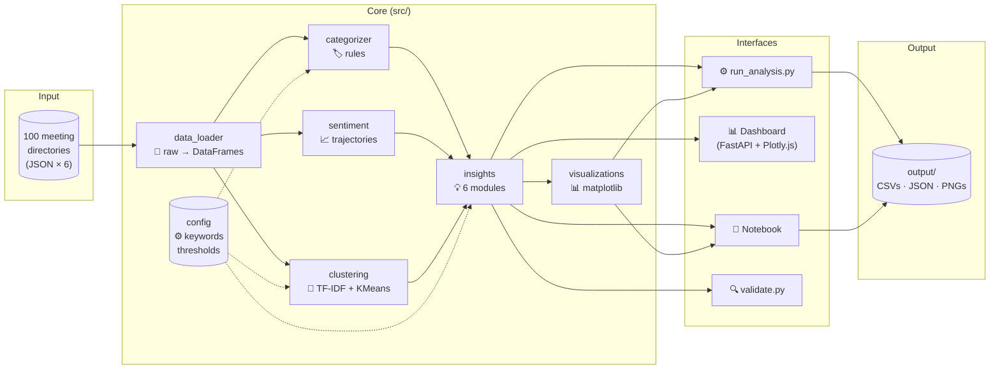
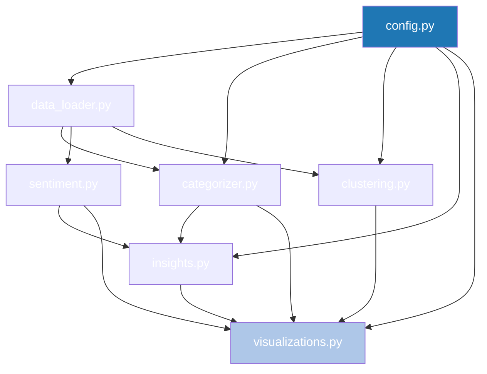
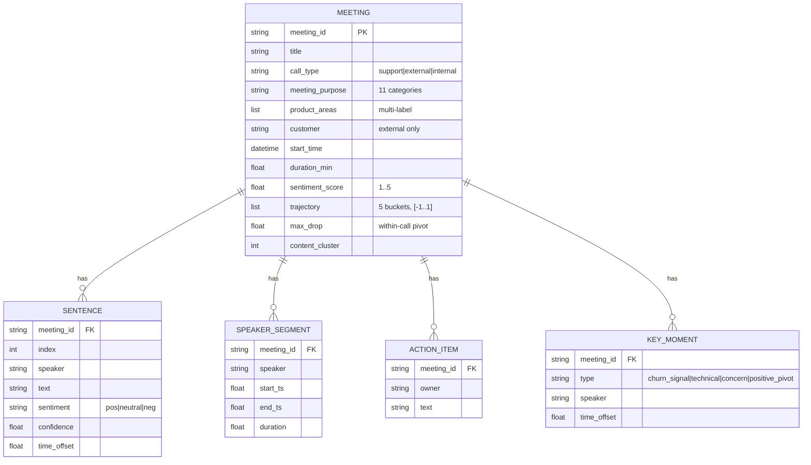
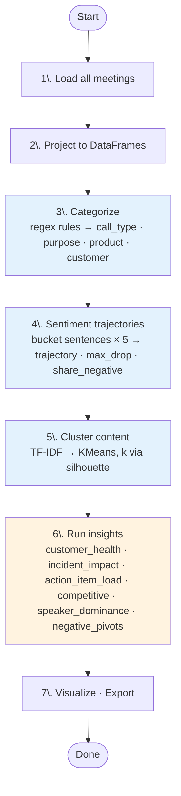
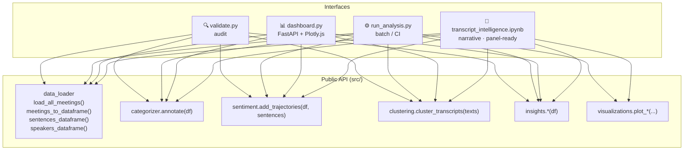
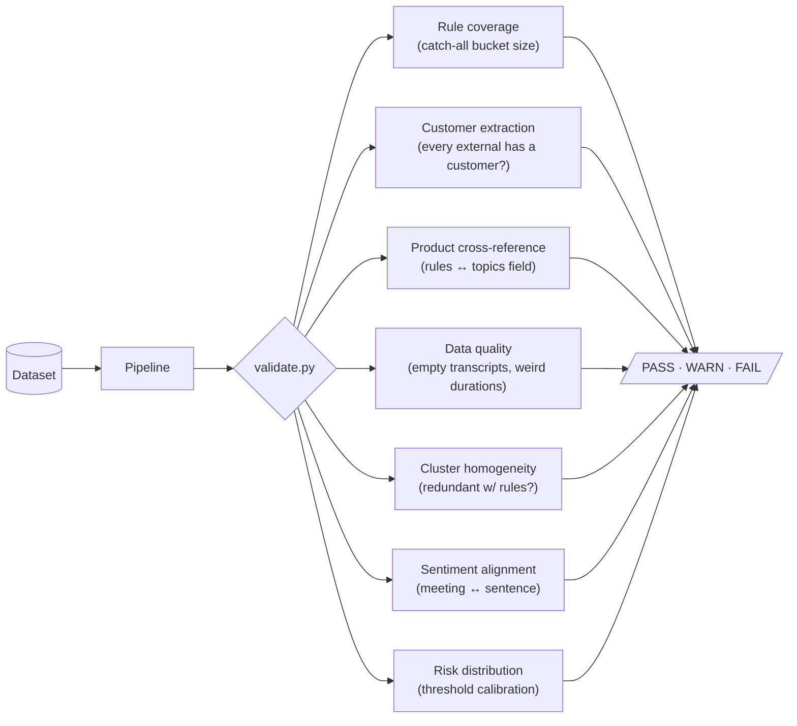

# Architecture

How the system is organized and how data flows through it.

## Design principles

| Principle | What it means in practice |
|---|---|
| **Single source of truth** | All categorization rules, thresholds, and keyword lists live in `src/config.py`. Analysis modules read from config — they never hardcode their own values. |
| **Pure functions where possible** | Each insight module takes DataFrames in, returns a DataFrame out. Composable, testable, dashboard-friendly. |
| **One core, many surfaces** | The notebook, FastAPI dashboard, batch CLI, and validator all import from `src/`. No duplicated logic. |
| **Rules + ML, not rules vs ML** | Regex for high-structure decisions; TF-IDF/KMeans for latent themes; fine-tuned LLM for tasks where rules can't compete. Layered, not opposed. |
| **Validate semantically, not just syntactically** | Unit tests verify rule behavior; `validate.py` audits the rules against the actual dataset. |

---

## System overview

Raw JSON enters from the left, gets parsed into typed DataFrames, then enriched in three parallel passes (categorize · sentiment · cluster). Insight modules consume the enriched frames. Four interfaces draw from the same insight functions — no logic duplicated across them.

---

## Module dependencies

`config.py` is the dependency root — every other module reads from it. `visualizations.py` is the leaf. Clean DAG; no cycles.

---

## Data model

A meeting directory contains six JSON files. We project them into three tabular shapes for analysis.

`MEETING` is the analysis-ready row. The categorizer adds `call_type`, `meeting_purpose`, `product_areas`, `customer`. The sentiment module adds `trajectory`, `max_drop`, `share_negative`. The clustering module adds `content_cluster`.

---

## Pipeline stages

Stages 3–5 run in series in `run_analysis.py` but are independent on data — could be parallelized.

---

## Interface layering

Every interface uses the same public API. Change a function in `src/`, every interface picks it up automatically.

---

## Validation flow

Each check is a small function returning a `Check(name, status, detail)`. Adding a new audit is one new function and one line in `main()`.

---

## Performance & caching

| Layer | Cache | Reason |
|---|---|---|
| Streamlit / FastAPI | Pipeline state cached at startup (thread-safe singleton) | Pipeline runs once per process, not per request |
| Notebook | None | Re-running cells is the user's intent |
| CLI | None | Designed for one-shot batch |

End-to-end runtime: ~10s on 100 meetings. The bottleneck is silhouette-based `k` selection (fits 7 KMeans models). At 10x scale, switch to mini-batch KMeans or run the silhouette sweep on a sample.

---

## Extensibility

How to add new things without touching unrelated code:

| Add a new… | Steps |
|---|---|
| **Insight** | New function in `insights.py` taking `df` → returning a DataFrame. Wire into `run_analysis.py`, the notebook, and the dashboard. |
| **Categorization rule** | Edit `config.PURPOSE_RULES` or `config.PRODUCT_KEYWORDS`. Add a test in `tests/test_categorizer.py`. No analysis code touched. |
| **Validation check** | New function in `validate.py` returning `Check(...)`. One new line in `main()`. |
| **Visualization** | New `plot_*` function in `visualizations.py`. Call from notebook or CLI runner. |
| **API endpoint** | New route in `api/routes.py` + Pydantic response model in `api/models.py`. |
