# Architecture

How the system is organized and how data flows through it.

## Design principles

| Principle | What it means in practice |
|---|---|
| **Single source of truth** | All categorization rules, thresholds, and keyword lists live in `src/config.py`. Analysis modules read from config — they never hardcode their own values. |
| **Pure functions where possible** | Each insight module takes DataFrames in, returns a DataFrame out. Composable, testable, dashboard-friendly. |
| **One core, many surfaces** | The notebook, FastAPI dashboard, batch CLI, and validator all import from `src/`. No duplicated logic. |
| **Rules + ML, not rules vs ML** | Regex for high-structure decisions; TF-IDF/KMeans for latent themes; fine-tuned LLM for tasks where rules can't compete. Layered, not opposed. |
| **Validate semantically, not just syntactically** | Unit tests verify rule behavior; `validate.py` audits the rules against the actual dataset. |

---

## System overview

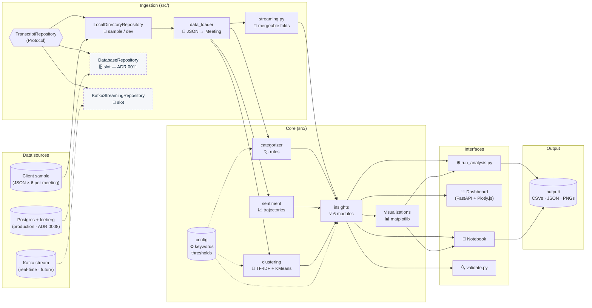

Raw inputs enter on the left and pass through the **ingestion layer** — a `TranscriptRepository` Protocol with one concrete backend today (`LocalDirectoryRepository`, reading the client sample from disk) and two slots wired through the same interface (`DatabaseRepository` for ADR 0008's Postgres + Iceberg, `KafkaStreamingRepository` for real-time). `data_loader` parses each meeting into a typed `Meeting`, and `streaming.py` exposes a mergeable fold so the same pipeline runs at production volume. The core then enriches the data in three parallel passes (categorize · sentiment · cluster), insight modules consume the enriched frames, and four interfaces draw from the same insight functions — no logic duplicated across them.

The next four diagrams unpack this picture along orthogonal axes: **layers** (what each tier owns), **per-meeting flow** (how a single record is enriched), **runtime topology** (what processes exist and what they share), and **control vs. data plane** (operator surfaces vs. analyst surfaces).

### Layered view — what lives at each tier

The system is a five-tier stack. Each tier has one job and depends only on the tiers below it. Two cross-cutting capabilities (configuration + observability) thread through every tier.

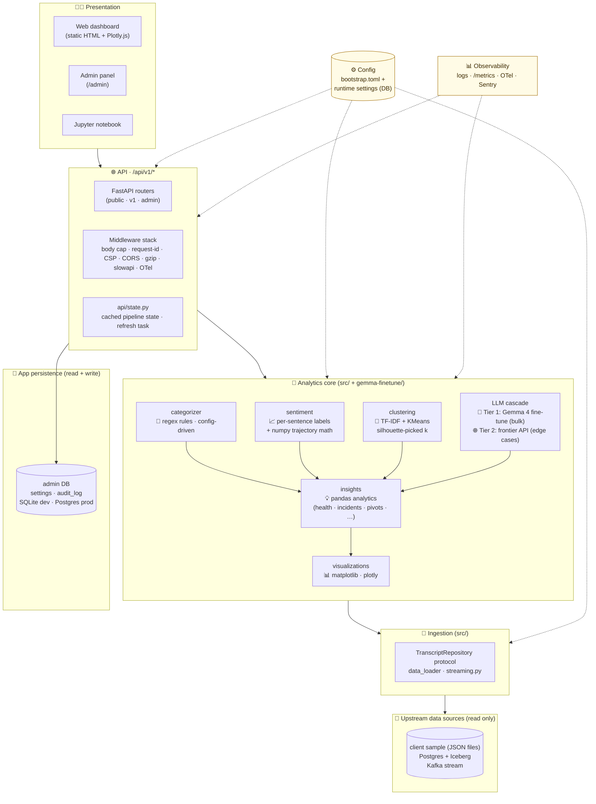

The enforcement of this layering shows up in the import graph (next section): no module reaches across more than one tier.

### Per-meeting data flow

Following one meeting from raw transcript to dashboard chart:

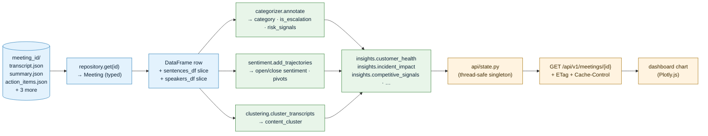

A single meeting is enriched in three independent passes, fed into the insight functions, and the result is cached process-wide. Subsequent dashboard reads hit the cache + an HTTP `ETag`/`Cache-Control` layer — no recomputation per request.

### Runtime topology — what runs, what's shared

A typical production deployment is a small fixed set of processes plus an observability sidecar surface:

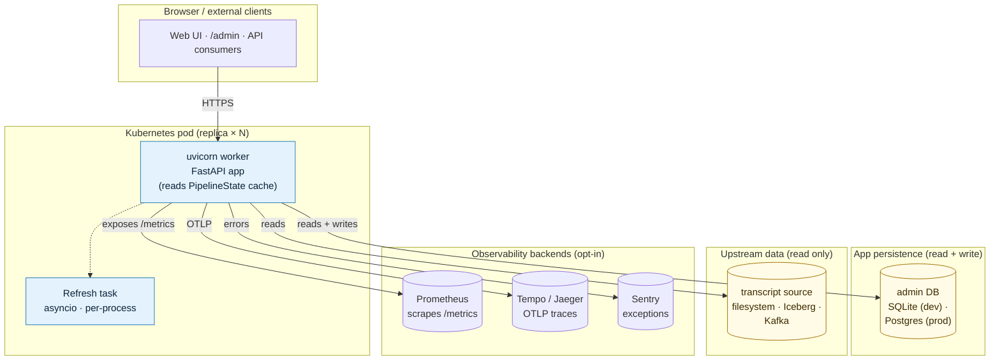

Each replica owns a private in-memory `PipelineState` cache and a private refresh task. State is process-local on purpose — there's no Redis dependency for the analytical cache; replicas converge on each refresh tick. The shared persistence boundary is the admin DB (settings + audit log) and the transcript source.

### Control plane vs. data plane

The system has two distinct surfaces that share infrastructure but serve different audiences:

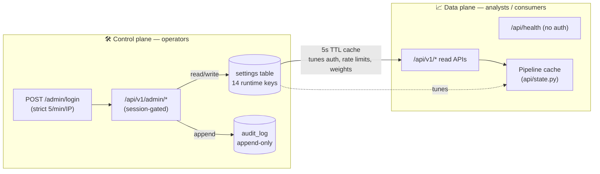

Operators tune behavior in the **control plane** (rate limits, churn weights, the API key, feature flags) and every change is audited. Analysts consume the **data plane** through versioned read APIs whose behavior is parameterized by the control plane's current settings — so an operator can adjust risk thresholds without a deploy, and the change propagates to every replica within 5 seconds (the runtime-settings cache TTL).

### Analytics core — what each algorithm does

The "Analytics core" tier in the layered view is intentionally heterogeneous: rules, classical ML, and a fine-tuned LLM each handle the work they're best at. ADR 0002 explains why this hybrid beats any one approach taken to the limit; the diagram below pins what's where.

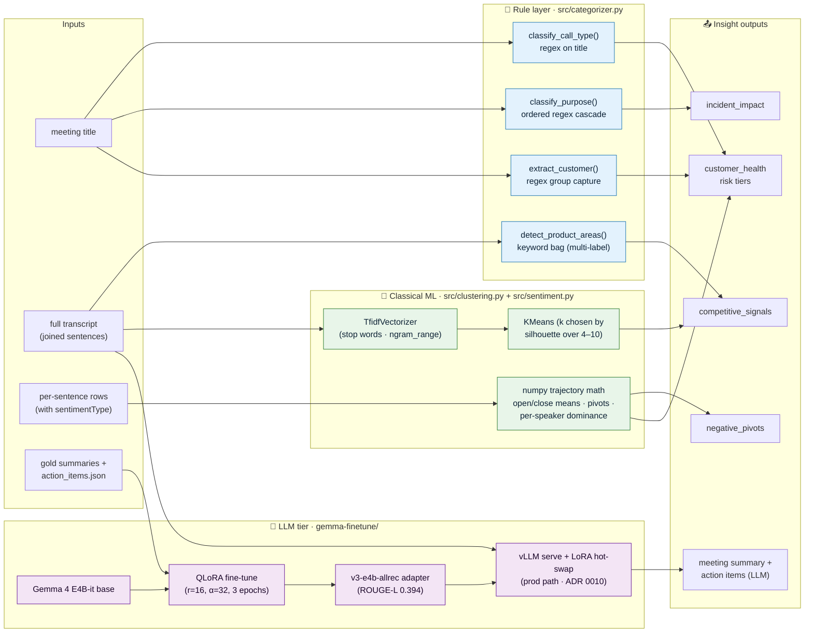

| Layer | Algorithm | Where | Why this layer | Cost / latency |
|---|---|---|---|---|
| **Rules** | Compiled regex + keyword bags, config-driven | `src/categorizer.py` (rules in `src/config.py`) | Call types and purposes follow strict prefixes (`Support Case #`, `Aegis /`, `URGENT:`) — rules cover ~90% with sub-ms inference and full auditability. | <1 ms · free · deterministic |
| **Sentiment** | Per-sentence labels (from source data) + numpy trajectory math | `src/sentiment.py` | Trajectories surface mid-meeting pivots that an averaged score hides. Pure numeric work — no model needed. | <10 ms / meeting · free |
| **Classical ML** | TF-IDF (sklearn) → KMeans, `k` chosen by silhouette over 4–10 | `src/clustering.py` | Catches latent cross-cutting themes (multi-product migrations, cost-driven renewals) that the rules' fixed taxonomy can't see. | seconds for sample; MiniBatchKMeans / Spark MLlib at 10M+ (ADR 0008) |
| **LLM (fine-tuned)** | Gemma 4 E4B-it + QLoRA adapter (`v3-e4b-allrec`, ROUGE-L 0.394) | `gemma-finetune/` adapters; production path served via vLLM with multi-tenant LoRA hot-swap (ADR 0010) | Generative tasks where rules and clustering can't compete: meeting summary in client house style + structured action-item extraction. | ~150 ms / meeting on H100 vLLM; $1.40 to train v3 on the sample |
| **Insights** | Pandas joins, weighted scoring, threshold logic | `src/insights.py` | Composes the four signal layers above into business-readable outputs (customer health, incident impact, competitive mentions, negative pivots). | <100 ms / meeting |

**No LLM in the categorization path.** ADR 0002 documents the deliberate choice: zero-shot LLM matched the rules' accuracy at the sample's structure but added $1–$10/1k-doc cost, 0.5–3s latency, non-determinism, and a data-egress surface — none of which were worth paying for a problem rules already solve. The LLM earns its cost on the *generative* tasks (summaries + action items), not the classification ones.

The training pipeline for the LLM tier (Ray Data dataset prep → multi-node FSDP fine-tune → adapter registry → vLLM serving with autoscaled GPU pools → active-learning feedback loop) is a separate auto-scaling architecture; see ADR 0010 and the "Auto-scaling ML pipeline" section below.

#### LLM cascade — fine-tuned for bulk, frontier model for edge cases

The fine-tuned Gemma 4 adapter is the right tool for the **bulk** of generative work — in-distribution summaries and action items where it's cheap, fast, and self-hosted. It's the wrong tool for **edge cases**: out-of-distribution meetings (new product domains, languages), long-context reasoning across an account's history, world-knowledge-dependent comparisons, and high-stakes outputs that warrant a second opinion. For those, we route to a frontier model (Claude / GPT-4 / Gemini Pro) as Tier 2.

```mermaid
flowchart LR
    In["meeting input"] --> Rules["📏 Rules<br/>categorization · extraction"]
    Rules --> T1{"Tier 1<br/>fine-tuned Gemma 4<br/>vLLM + LoRA hot-swap"}
    T1 --> Conf{"confidence<br/>signals OK?"}
    Conf -->|yes (~95% of traffic)| Out1["🚀 ship<br/>~150 ms · $0 marginal"]
    Conf -->|no| Guard{"PII redaction +<br/>per-tenant policy<br/>+ daily $ budget"}
    Guard -->|allow| T2["🌐 Tier 2 frontier model<br/>(Claude/GPT-4/Gemini)<br/>via gateway"]
    Guard -->|deny| Fallback["return Tier-1 result<br/>flagged 'low confidence'"]
    T2 --> Cache[("response cache<br/>(input hash → output)")]
    Cache --> Out2["✅ ship<br/>~1–3 s · $0.005–0.05 / call"]
    T2 --> Train[("active-learning queue<br/>→ next Gemma fine-tune")]

    classDef fast fill:#e8f5e9,stroke:#2e7d32,color:#0d2235
    classDef slow fill:#f3e5f5,stroke:#6a1b9a,color:#1a0628
    classDef guard fill:#fffbe6,stroke:#a06b00,color:#3d2a00
    class Rules,T1,Out1 fast
    class T2,Out2 slow
    class Guard,Fallback guard
```

**Escalation triggers** (any one fires → Tier 2):
- Generation perplexity above a tuned threshold (Gemma is uncertain).
- LLM-as-judge score below threshold on the Tier-1 output (we already use this signal for active-learning).
- Out-of-distribution flag — input embedding far from the training distribution centroid.
- Operator-flagged or product-flagged categories (e.g., legal, executive briefs) configured in `runtime_settings`.
- Long-context jobs (>8k tokens of input or multi-meeting joint analysis) — Gemma's context is too short, route directly.

**Guardrails before any external call** — every escalation goes through a gateway that enforces:
- **PII redaction** (regex + spaCy NER) before the payload leaves the perimeter.
- **Per-tenant policy** — customers requiring data residency or no-third-party-LLM are blocked at this hop and get the Tier-1 result flagged "low confidence."
- **Daily $ budget cap** per tenant; over budget → Tier-1 result + alert.
- **Response cache** keyed on `(input hash, prompt version)` — identical inputs don't re-pay.
- **Audit log** entry per call (which model, latency, $ cost, redaction summary).

**Closing the loop with active learning.** Every Tier-2 escalation is a high-signal training example: the production data point Gemma struggled on plus a frontier-model reference output. Those flow into the active-learning queue (ADR 0010) and become the next Gemma fine-tune. Tier-2 traffic share is the headline metric for this loop — when it trends down for a category, Gemma has learned that pattern and the cost decays.

**Why not "frontier-only"?** At the volume envelope this system targets (millions to 100M+ meetings), running every meeting through a frontier API is cost-prohibitive ($1k–$1M/day) and creates a hard third-party dependency on the latency-critical path. The cascade gives ~95% of the cost economics of self-hosting *and* the quality ceiling of frontier models on the 5% that needs it.

> The frontier-LLM gateway is a **planned** addition (the diagram and rationale belong in this doc so the architecture target is unambiguous). It is not yet implemented — see ADR 0012 for the decision record and rollout plan.

---

## Module dependencies

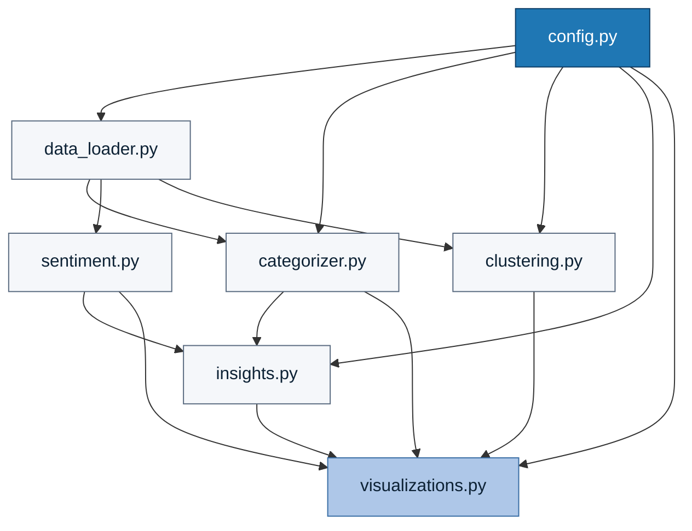

`config.py` is the dependency root — every other module reads from it. `visualizations.py` is the leaf. Clean DAG; no cycles.

---

## Data model

A meeting directory contains six JSON files. We project them into three tabular shapes for analysis.

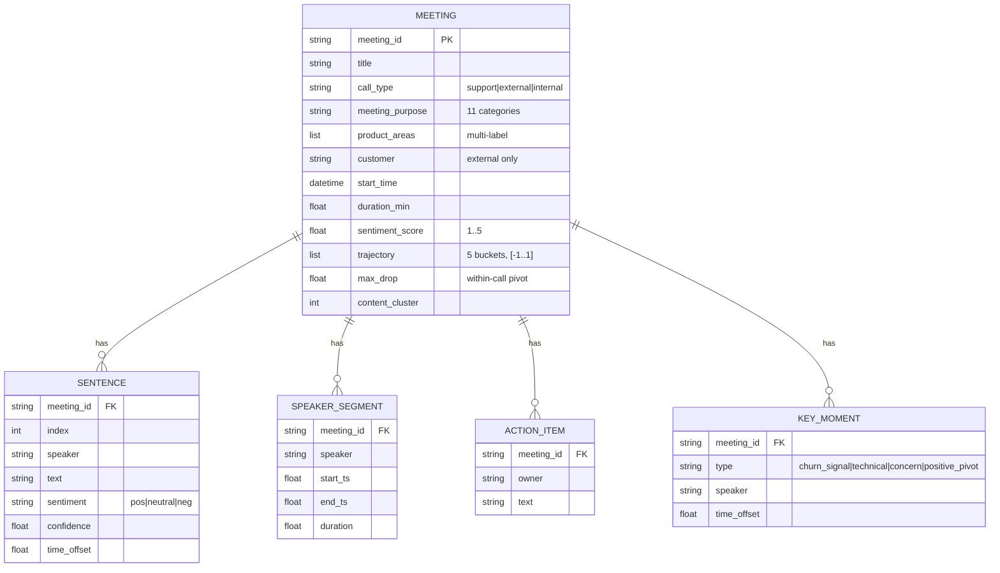

`MEETING` is the analysis-ready row. The categorizer adds `call_type`, `meeting_purpose`, `product_areas`, `customer`. The sentiment module adds `trajectory`, `max_drop`, `share_negative`. The clustering module adds `content_cluster`.

---

## Pipeline stages


Stages 3–5 run in series in `run_analysis.py` but are independent on data — could be parallelized.

---

## Interface layering

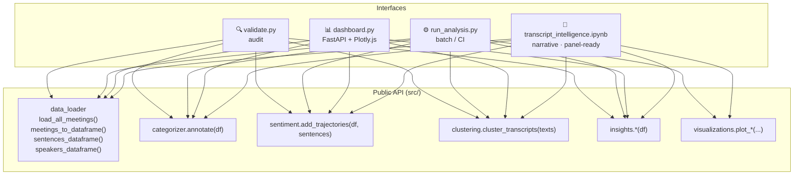

Every interface uses the same public API. Change a function in `src/`, every interface picks it up automatically.

---

## Validation flow

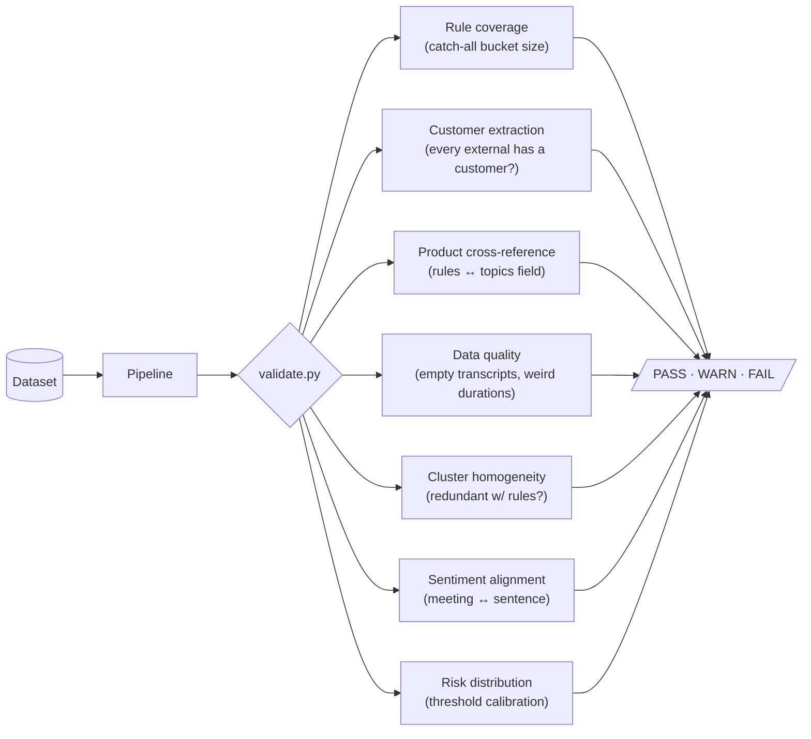

Each check is a small function returning a `Check(name, status, detail)`. Adding a new audit is one new function and one line in `main()`.

---

## API request lifecycle

A request to a `/api/v1/*` endpoint flows through this middleware stack:

```mermaid
flowchart TD
    Req[Incoming request] --> Body["BodySizeLimitMiddleware<br/>reject >1 MiB up front (DoS guard)"]
    Body -->|too large| Err413["413 + error envelope"]
    Body -->|ok| RID["RequestIDMiddleware<br/>mint or honor X-Request-ID<br/>start latency timer"]
    RID --> Sec["SecurityHeadersMiddleware<br/>CSP · HSTS · X-Frame-Options · …"]
    Sec --> CORS["CORSMiddleware<br/>configurable origins"]
    CORS --> GZ["GZipMiddleware<br/>compresses payloads >500B"]
    GZ --> RL["SlowAPI rate limiter<br/>X-RateLimit-* headers"]
    RL --> Strict{"strict_rate_limit dep<br/>(admin login + password only)<br/>5/min/IP"}
    Strict -->|exceeded| Err429["429 + error envelope"]
    Strict -->|ok| OTel["OpenTelemetry<br/>(if OTEL_ENDPOINT set)"]
    OTel --> Auth{X-API-Key check<br/>(if API_KEY set)}
    Auth -->|invalid| Err401["401 + error envelope"]
    Auth -->|ok / disabled| ETag{If-None-Match<br/>matches ETag?}
    ETag -->|yes| NotMod["304 Not Modified<br/>no body, ETag preserved"]
    ETag -->|no| Route["Route handler<br/>reads PipelineState<br/>stamps ETag + Cache-Control"]
    Route --> Stale["StateAgeMiddleware<br/>X-State-Age-Seconds<br/>X-Stale-Response (if applicable)"]
    Stale --> Resp[Response]

    style Body fill:#fff3e0
    style Err413 fill:#ffcdd2
    style RID fill:#e3f2fd
    style Sec fill:#e3f2fd
    style GZ fill:#e8f5e9
    style RL fill:#fff3e0
    style Strict fill:#fff3e0
    style Err429 fill:#ffcdd2
    style Auth fill:#ffebee
    style Err401 fill:#ffcdd2
    style ETag fill:#e8f5e9
    style NotMod fill:#e8f5e9
```

All errors — `HTTPException`, `RequestValidationError`, unhandled — funnel through the same handler in `api/errors.py` and come back as:

```json
{
  "error": {
    "code": "not_found",
    "message": "meeting X not found",
    "request_id": "9574…",
    "path": "/api/v1/meetings/X"
  }
}
```

The `/api/health` endpoint is registered on a separate **public** router that bypasses the auth dependency — load balancers and k8s probes need to hit it without credentials.

---

## Scaling to 100M+ records

The client provided a representative **sample** (currently ~100 meetings, ~4k sentences). The current single-instance, in-memory pipeline is correct **for that sample volume** — it's how we verify pipeline correctness end-to-end during development. At **production volume (millions to 100M+ records)** the substrate changes — the analytical layers run against a real data platform — but the *application code shape* stays mostly the same.

### Scale envelopes per component

| Component | Comfortable up to | Breaks at | Path forward |
|---|---|---|---|
| Regex categorizer | Billions / day on a single thread | n/a — CPU-bound, parallelizes trivially | Already good |
| TF-IDF + KMeans clustering (in-memory) | ~1M docs in-memory | ~10M (RAM ceiling) | Streaming MiniBatchKMeans, then Spark MLlib / Faiss |
| Per-sentence sentiment trajectories | ~1M docs in-memory | ~10M (RAM ceiling) | **Already supported via streaming pipeline** (`src/streaming.py` — `run_analysis.py --streaming`); fold pattern is mergeable so it parallelizes across Ray Data workers |
| Customer health + insight aggregation | ~1M docs in-memory; **unbounded via streaming** | ~10M in-memory groupby | Streaming fold writes per-customer rollup to CSV/Postgres incrementally |
| Pipeline state singleton (`api/state.py`) | ≤ ~100k rows | Memory-bound | DatabaseRepository slot in `src/repository.py` — no call-site changes |
| Repository (data source) | LocalDirectoryRepository: ~100k meetings | Filesystem inode latency | Swap `default_repository()` to return `DatabaseRepository` — Postgres + Iceberg backed |
| FastAPI request layer | Stateless — replicates horizontally | LB / DB-bound | Multi-instance behind LB, Redis cache for hot queries |
| Gemma 4 inference | One pod = ~10 RPS | Pod queue depth | vLLM autoscale → ADR 0010 |
| Schema migrations | Hand-edited DDL in `db.init_db()` | First production schema change | **Alembic now in place** — `alembic upgrade head` |

The point: **every layer has a known ceiling and a known next step**. Nothing requires a rewrite to scale; each transition is a targeted swap with a measurable trigger documented in the relevant ADR.

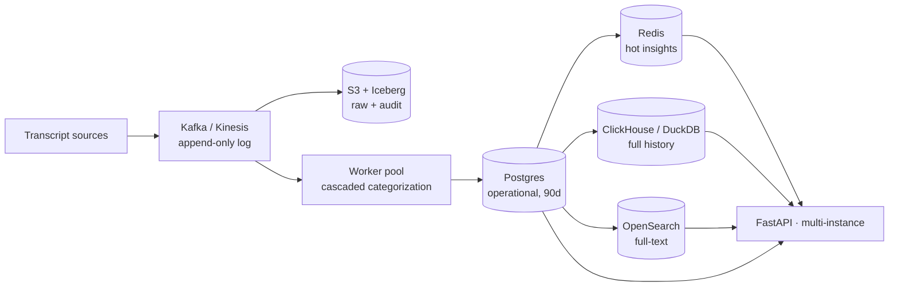

**What changes:**
- Pandas in-memory → Postgres canonical + columnar warehouse for analytics
- All-meetings-at-startup → streaming ingestion via Kafka, materialized views
- Single instance → multi-replica behind a load balancer with shared Redis cache

**What doesn't change:**
- Categorization cascade (rules → classifier → LLM) — see ADR 0002
- Sentiment trajectory math — see ADR 0007
- The 6 insight functions — they run against repository interfaces, swappable backend
- The admin panel + runtime settings store — operates on the same Postgres at any scale
- The Gemma 4 fine-tuning **recipe** — only the orchestration layer changes (single H100 → multi-node FSDP via Ray Train; see ADR 0010)

Migration is incremental: each step in [ADR 0008](adr/0008-data-layer-for-scale.md#migration-path-concrete-sequential) is independently shippable, none requires a wholesale rewrite. The current SQLite + SQLAlchemy code is the foundation — change `bootstrap.toml`'s database URL to Postgres and step #2 is done.

---

## Auto-scaling the API tier

ADR 0010 covers the ML pipeline (training + vLLM serving). The **API tier itself** has its own auto-scaling story — and several gaps the current implementation hasn't yet closed. ADR 0013 documents the target; the diagram below shows it.

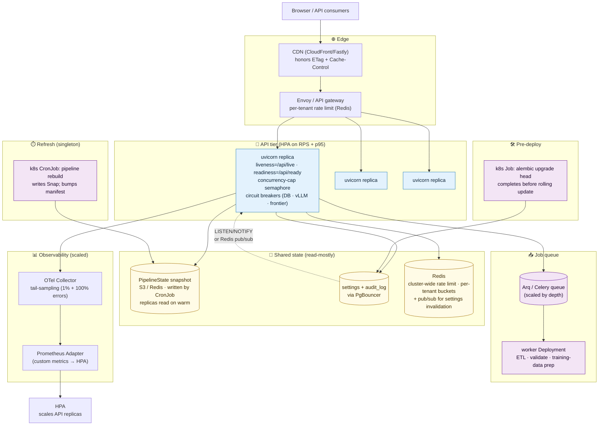

The 15 specific improvements (cold-start snapshot, externalized refresh, Redis-backed cluster-wide rate limiting, custom-metric HPA, migrations as a Job, PgBouncer, concurrency-cap backpressure, circuit breakers, settings-change pub/sub, split liveness/readiness, async job queue, CDN, per-tenant fairness, OTel collector + sampling, graceful shutdown) are tabled in [ADR 0013](adr/0013-api-tier-auto-scaling.md). Current code already does some of this (lifespan-based shutdown, ETag headers, slowapi); the rest is the next production-readiness PR.

---

## Auto-scaling ML pipeline (training + serving)

The Gemma 4 fine-tune in [ADR 0003](adr/0003-self-host-summarization-with-gemma-4.md) was a deliberate proof-of-concept on the client sample (~95 train meetings on a single H100, $1.40 wall-clock cost) — sufficient to demonstrate the recipe works and the economics close. **Production scales every layer independently** without changing the trainer logic:

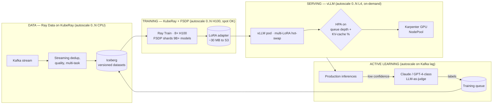

Each layer scales on the **right signal** and stops at zero when idle:

| Layer | Scales on | Floor | Ceiling |
|---|---|---|---|
| Data prep | Kafka lag | 0 workers | Kafka-bound |
| Training | Job submission | 0 H100 nodes (spot OK) | Per-job request |
| Serving | `vllm_pending_requests` + `vllm_gpu_cache_usage_perc` | 1 always-warm L4 pod | Queue-bound |
| Active learning | Pending labels | 0 workers | Daily LLM-judge budget |

Code skeletons + production K8s manifests live in [`gemma-finetune/scaling/`](../gemma-finetune/scaling/README.md). The single-H100 recipe stays as the local-development entry point; the same trainer logic runs on a 32-GPU cluster via Ray Train. **The recipe doesn't change. The substrate does.**

### Training stack — what's where

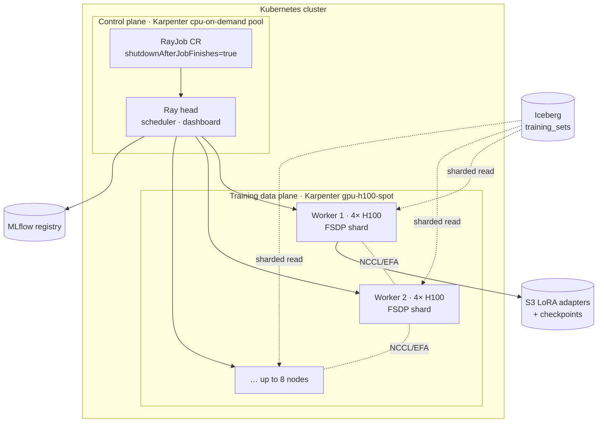

### Serving stack — autoscaling chain end-to-end

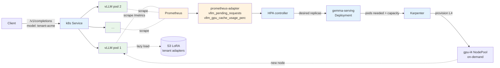

Two real signals drive scale-up: queue depth (`vllm_pending_requests`) and KV-cache pressure (`vllm_gpu_cache_usage_perc`). CPU% is intentionally not in the loop — it's misleading for GPU inference.

See [ADR 0010](adr/0010-auto-scaling-ml-pipeline.md) for the full architecture, cost math, and decision rationale.

---

## Admin panel — runtime configuration without env vars

Operationally-tunable knobs (rate limits, churn-risk weights, feature flags, the auth API key) live in a database-backed settings store. Operators change them through `/admin` — every change is audited.

```mermaid
flowchart LR
    Boot["bootstrap.toml<br/>(env, log, DB url, admin secret)"] --> App[FastAPI app]
    App --> RuntimeStore[(settings table<br/>admin DB)]
    Browser[Browser] --> Login["POST /api/v1/admin/login"]
    Login -->|signed cookie| Browser
    Browser --> Admin["/admin · settings UI"]
    Admin -->|GET PUT POST| AdminAPI[/api/v1/admin/*]
    AdminAPI --> RuntimeStore
    AdminAPI --> Audit[(audit_log)]
    RuntimeStore -->|5s TTL cache| App
```

What lives where:

| Type of config | Lives in | Examples | Mutable at runtime? |
|---|---|---|---|
| **Bootstrap** | `bootstrap.toml` | env label, log level, DB URL, admin session secret | No (restart required) |
| **Runtime** | DB `settings` table | API key, rate limits, churn weights, feature flags | Yes — change in `/admin`, takes effect within 5s |

**No env vars** are read for application configuration. The runtime substrate (uvicorn, k8s) may still use them for infrastructure. See [ADR 0009](adr/0009-admin-panel-for-runtime-config.md) for the full rationale.

---

## Security hardening

Defense-in-depth controls layered onto the request path:

| Control | Where | Purpose |
|---|---|---|
| `BodySizeLimitMiddleware` (1 MiB) | outermost middleware | Reject oversized requests before any handler allocates buffers — DoS guard. |
| Strict 5/min/IP rate limit | `Depends(strict_rate_limit)` on `/admin/login` + `/admin/password` | Slow brute-force credential attacks below the global slowapi cap. |
| Global slowapi rate limiter | app-wide | Per-IP fairness across all routes; admin-tunable via `rate_limit.default`. |
| PBKDF2-SHA256 (200k iters) | `api/admin/auth.py` | Admin password hashing. |
| HMAC-signed session cookie | `api/admin/auth.py` | `Secure` (prod) + `HttpOnly` + `SameSite=Strict`. |
| `SecurityHeadersMiddleware` | per response | CSP, HSTS (prod), X-Frame-Options, X-Content-Type-Options, Referrer-Policy, Permissions-Policy. |
| Audit log | `audit_log` table | Every admin mutation recorded with actor + before/after value. |

Reporting process and scope live in [`SECURITY.md`](../SECURITY.md).

---

## Operational lifecycle

Container start (`Dockerfile` entrypoint):

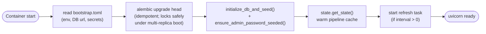

Schema evolution flows through Alembic — `db.init_db()`'s create-all is now an idempotent fallback for sample-volume tests; production-equivalent containers always run migrations on boot.

---

## Performance & caching

| Layer | Cache | Reason |
|---|---|---|
| Streamlit / FastAPI | Pipeline state cached at startup (thread-safe singleton) | Pipeline runs once per process, not per request |
| Notebook | None | Re-running cells is the user's intent |
| CLI | None | Designed for one-shot batch |

End-to-end runtime: ~10s on the client's sample dataset. The bottleneck is silhouette-based `k` selection (fits 7 KMeans models). At ~10× the sample size the silhouette sweep should run on a sample, not the full set; at ~100× MiniBatchKMeans replaces KMeans; beyond that the clustering is out-of-process via Spark MLlib (see ADR 0008's analytical tier).

---

## Extensibility

How to add new things without touching unrelated code:

| Add a new… | Steps |
|---|---|
| **Insight** | New function in `insights.py` taking `df` → returning a DataFrame. Wire into `run_analysis.py`, the notebook, and the dashboard. |
| **Categorization rule** | Edit `config.PURPOSE_RULES` or `config.PRODUCT_KEYWORDS`. Add a test in `tests/test_categorizer.py`. No analysis code touched. |
| **Validation check** | New function in `validate.py` returning `Check(...)`. One new line in `main()`. |
| **Visualization** | New `plot_*` function in `visualizations.py`. Call from notebook or CLI runner. |
| **API endpoint** | New route in `api/routes.py` + Pydantic response model in `api/models.py`. |
