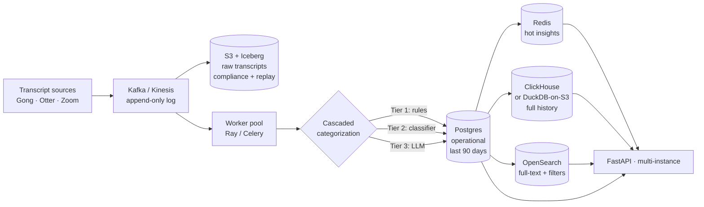

# ADR 0008: Data Layer for 100M+ Records

- **Status:** Accepted
- **Date:** 2026-05-06
- **Supersedes (partially):** ADR 0005 — at scale, the "no database" verdict no longer holds

## Context

ADR 0005 documented why we ship without a database today: the input is static JSON, every endpoint is read-only, the pipeline rebuilds in seconds, and a single-tenant in-memory cache covers the workload. That verdict was right for verifying the system end-to-end during development and remains comfortable up to **~100k records**.

It does not survive contact with **100 million records**, which is the realistic production ceiling:

| Concern | Why the in-memory design breaks |
|---|---|
| Memory | 100M meetings × ~10 KB/meeting = ~1 TB. Doesn't fit in any single VM's RAM. |
| Cold start | Loading even 1M JSON files at startup is minutes; 100M is hours. |
| Multi-instance | Each replica building its own copy is wasteful and drift-prone. |
| Historical queries | "How did Customer X's sentiment trend across 18 months?" can't be answered from a snapshot. |
| Write operations | Annotations, manual category overrides, user feedback — all need persistence. |
| Multi-tenancy | Per-tenant data isolation needs a real authorization boundary. |

This ADR documents the **target architecture** at scale. The current codebase is the *first stage* of that architecture; this ADR captures what the next stages look like and what triggers the migration.

## Decision

A **tiered storage architecture** with separation of concerns: ingestion, online serving, analytics, and archival each get the right tool.

### Tier-by-tier rationale

| Layer | Tech | Why |
|---|---|---|
| **Ingestion** | Kafka or Kinesis | Decouples sources from processing; allows replay; back-pressure during traffic spikes |
| **Raw archive** | S3 + Apache Iceberg | Cheap immutable storage; queryable via Athena/Trino/DuckDB; compliance-friendly (partition keys + retention rules) |
| **Online OLTP** | Postgres | Mature ORM ecosystem (SQLAlchemy/alembic), strong consistency, well-understood ops, fits the canonical-state pattern |
| **Analytics** | ClickHouse (managed) or DuckDB-on-Iceberg | Columnar storage = 100× faster aggregations than Postgres at 100M+ rows; the customer-health dashboard becomes sub-second |
| **Search** | OpenSearch / Elasticsearch | Full-text on transcripts + faceted filters (call_type, date range, customer); the dashboard's free-text search comes from here |
| **Cache** | Redis | Hot insight queries (current at-risk customers, active incidents) precomputed and TTL'd |

### Schema-on-read vs schema-on-write

- **Postgres** = strict schema for the operational tables (Settings, Meetings, Insights, Audit). Migrations via alembic.
- **Iceberg/S3** = schema-on-read for raw transcripts. Schema can evolve without rewrites.
- **ClickHouse** = analytical schema, denormalized + columnar; rebuilt from Postgres+Iceberg via batch jobs.

### What stays the same as today

The **categorization cascade** described in ADR 0002 doesn't change at scale — rules → classifier → LLM, in that order. The sentiment trajectory math (ADR 0007) doesn't change. The 6 insights don't change. **What changes is the substrate they run on.**

## Migration path (concrete, sequential)

| Step | Tipping point | Effort |
|---|---|---|
| 1. Today: in-memory pandas (≤100k records) | — | Done |
| 2. Add Postgres for **persistence of derived state** (insights, customer_health) — recompute on schedule, serve from DB | 100k records / multi-instance need | ~1 week. SQLAlchemy already in the codebase for the admin DB. |
| 3. Add Redis cache for hot dashboard queries | p95 dashboard latency exceeds 200ms | ~3 days |
| 4. Move ingestion to Kafka; workers compute insights as streaming jobs | Real-time use cases (call coaching) | ~2 weeks |
| 5. Add ClickHouse / DuckDB-on-Iceberg for cross-time analytics | "How did sentiment trend over 18 months?" | ~1 week if data is already in S3 |
| 6. Move full-text search to OpenSearch | Free-text dashboard queries become slow | ~3 days |
| 7. Multi-tenancy: per-tenant isolation in Postgres + per-tenant fine-tuned LoRA adapters | First multi-tenant customer | ~2 weeks |

Each step is independently shippable. No big-bang rewrite.

## Foundation already in the current codebase

This ADR isn't aspirational. The current code already includes:

- **SQLAlchemy + SQLite** (`src/db.py`) — the ORM is in place. Switching `bootstrap.toml`'s `database.url` to a Postgres URL is a one-line change.
- **Repository pattern via the runtime settings store** (`src/runtime_settings.py`) — DB-backed config with TTL cache and audit log. Same pattern extends to insight repositories.
- **Audit log table** (`src/models_db.py::AuditLog`) — already partitionable by month via Postgres native partitioning.
- **Admin panel** (`/admin`) — operates on the same DB. Will work unchanged when we point at Postgres.

The migration to step #2 is an afternoon's work.

## Consequences

**Positive**
- Each layer earns its place via measurable triggers, not speculative scale
- Components are independently scalable: bottleneck Postgres → split read replicas; bottleneck ClickHouse → add nodes
- Compliance + audit story is robust (raw archive in Iceberg + audit log in Postgres)
- The whole system stays vendor-neutral: every tool listed has open-source variants

**Negative**
- Operational footprint grows substantially — Postgres + Redis + Kafka + ClickHouse + OpenSearch is a real platform team's worth of work
- Cost: at 100M records, infrastructure costs are a meaningful line item (~$10k–$50k/month depending on retention)
- Multi-system complexity: data drift between Postgres and ClickHouse needs reconciliation jobs and monitoring

**Neutral**
- The application code's *shape* doesn't change much — the same insights run against pluggable repositories. The complexity moves from the app code into infrastructure.

## When to revisit

- A managed product comes along that subsumes multiple tiers (e.g., MotherDuck for analytical + Iceberg, Neon for serverless Postgres, etc.) — simplify
- The dataset structure changes radically (binary embeddings, video, real-time streams) — re-evaluate the storage tier
- The cost-per-decision math from ADR 0002 changes due to model breakthroughs — re-evaluate the cascade

## Related

- ADR 0002 — categorization cascade (unchanged at scale, just runs against a different substrate)
- ADR 0005 — original "no database" verdict (this ADR partially supersedes)
- ADR 0006 — API key auth (deferred-JWT pattern; multi-tenancy in step #7 forces the JWT migration)
- ADR 0009 — admin panel + runtime settings (operational layer that scales unchanged)
