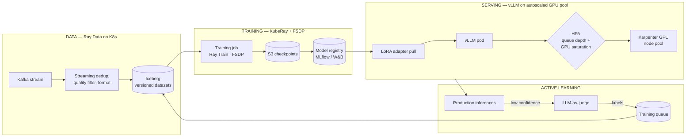
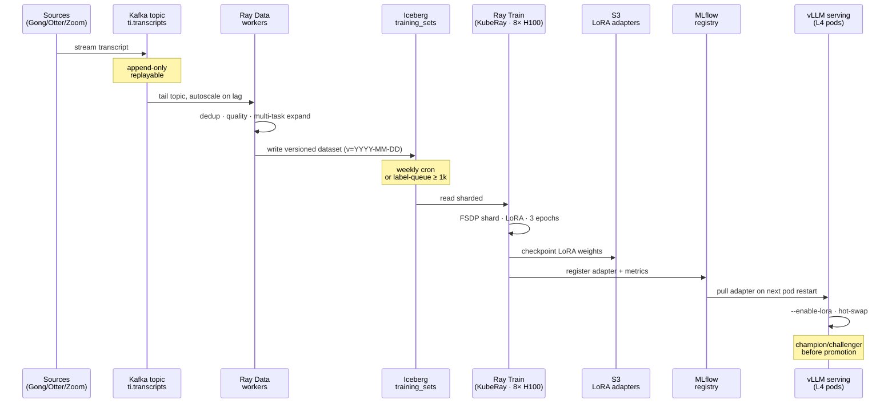
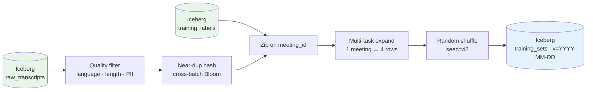
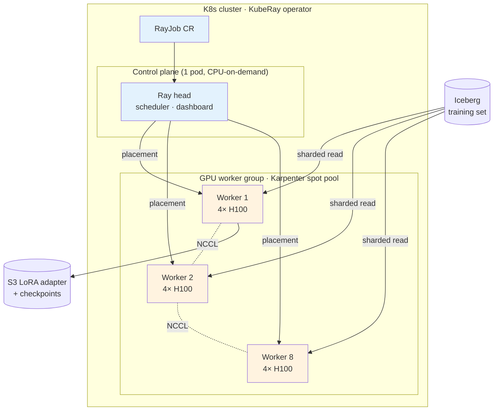
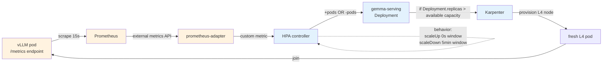
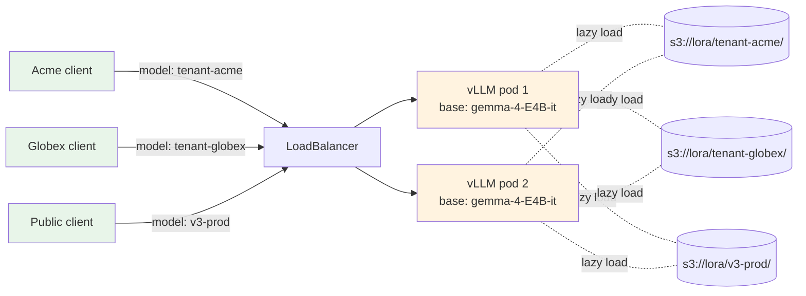
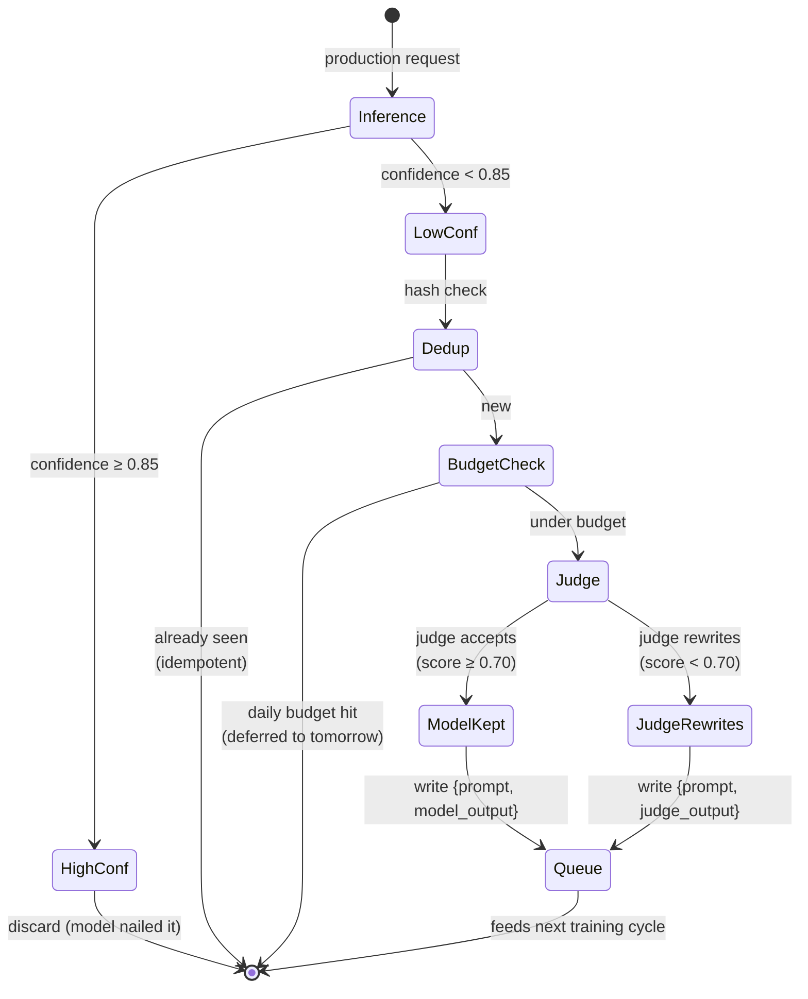

# ADR 0010: Auto-Scaling ML Pipeline — Data, Training, Serving

- **Status:** Accepted
- **Date:** 2026-05-06
- **Builds on:** ADR 0003 (Gemma 4 fine-tune), ADR 0008 (data layer for 100M+)

## Context

The system targets **millions to 100M+ records**, with the ML tier auto-scaling to match. The dataset shipped with the brief is a representative *sample* used for verification; the fine-tuning work in ADR 0003 ran against that sample — single H100, $1.40 wall-clock cost, 28 minutes — which was the right scope to *prove the recipe* and verify the cost economics close. It is **not** the right scope to run in production. The client also confirmed synthetic generation can supplement the sample for edge cases.

Production assumptions for this ADR:

| Dimension | Proof-of-concept (today, on the client sample) | Production target |
|---|---|---|
| Training set | ~95 meetings (the client sample) | 1M – 100M+ meetings, plus synthetic augmentation, growing daily |
| Train wall-clock | 28 min on 1× H100 | minutes per epoch on multi-node, hours total |
| Inference QPS | n/a | 10–10,000 RPS, bursty (US working hours) |
| p95 latency budget | n/a | <500 ms for summarization, <100 ms for classification |
| Cost ceiling | $1.40 | budget-bound, must autoscale to zero off-hours |
| Reliability | best-effort | 99.9% serving SLA, no manual intervention |
| Data privacy | demo dataset | per-tenant isolation; some tenants self-host |

**The recipe doesn't change.** What changes is the substrate.

## Decision

A **three-layer auto-scaling architecture**, each layer scaling independently against its own bottleneck signal:



Each layer has its **own scaling primitive** and its **own trigger metric**:

| Layer | Tech | Scales on | Scales to |
|---|---|---|---|
| Data prep | Ray Data on KubeRay | Kafka lag | 0–N CPU workers |
| Training | Ray Train + FSDP | Job submission queue | 0–N GPU nodes (spot OK) |
| Serving | vLLM on GPU pods + HPA | Request queue depth + GPU util | 0–N GPU pods (on-demand) |
| Active learning | Async worker pool | Pending labels in queue | 0–N CPU workers |

### End-to-end training cycle

How a transcript travels from production into the next model:



---

## Layer 1 — Data preparation at scale

### Ray Data streaming pipeline

```python
import ray
from ray.data import Dataset

def build_training_dataset(
    iceberg_table: str,           # raw transcripts
    label_table: str,             # gold summaries + active-learning labels
    output_path: str,             # versioned output (e.g., s3://.../v=2026-05-06/)
) -> Dataset:
    """Streaming pipeline — never materializes full dataset in memory."""
    ds = ray.data.read_iceberg(iceberg_table, parallelism=200)
    ds = (ds
        .filter(lambda r: r["language"] == "en")
        .map_batches(deduplicate, batch_size=1024)             # near-dup hashing
        .map_batches(quality_filter)                           # length/PII checks
        .zip(ray.data.read_iceberg(label_table))
        .map_batches(format_to_chat_template)                  # multi-task expansion
        .random_shuffle(seed=42)
    )
    ds.write_iceberg(output_path)
    return ds
```

**Why Ray Data:**
- Reads/writes Iceberg natively — version every training set
- Streaming — handles datasets larger than cluster memory
- Auto-scales worker pool from 0 to N based on Kafka lag / queue depth
- Same code runs on a laptop (1 worker) or a 100-node cluster

**Alternatives considered:** Spark (fine but heavier ops), Apache Beam (more flexible but more boilerplate), pure pandas (breaks at 10M+ rows).

### Pipeline stages



Each box runs as Ray Data tasks against an autoscaling worker pool. The pipeline streams — no stage materializes the full dataset. Multi-task expansion (the trick that took v3 from loss 1.18 → 0.37) is just one `flat_map` step.

## Layer 2 — Distributed training

### Ray Train + FSDP for multi-node fine-tuning

The single-H100 recipe in `finetune_v3.py` extends to a multi-node FSDP job with no code changes to the *trainer logic* — only the orchestration layer.

```python
import ray
from ray.train.torch import TorchTrainer
from ray.train import RunConfig, ScalingConfig

trainer = TorchTrainer(
    train_loop_per_worker=train_one_epoch,    # same v3 recipe, distributed
    scaling_config=ScalingConfig(
        num_workers=8,                         # 8 nodes (auto-provisioned)
        use_gpu=True,
        resources_per_worker={"GPU": 4},       # 4× H100 per node = 32 H100 total
        placement_strategy="SPREAD",
    ),
    run_config=RunConfig(
        name="gemma4-v5",
        storage_path="s3://ti-models/checkpoints",
        checkpoint_config=CheckpointConfig(num_to_keep=3),
    ),
)
result = trainer.fit()
```

### KubeRay topology — what runs where



`shutdownAfterJobFinishes=true` in the RayJob CR means the operator tears the cluster down on completion; Karpenter reclaims the H100 nodes within 60 seconds. Zero idle GPU spend.

### Key production concerns

| Concern | Approach |
|---|---|
| **Spot interruption** | Ray's checkpoint resume + KubeRay's spot tolerance; lose at most one epoch |
| **Multi-node communication** | NCCL with EFA / GPUDirect when on AWS p4d/p5; topology-aware allocation |
| **Sharded weights** | FSDP for 9B+ models that don't fit per-GPU; LoRA adapters (~30MB) for everything else |
| **Hyperparameter sweeps** | Ray Tune over the same trainer, ASHA or BOHB scheduler |
| **Experiment tracking** | MLflow on the cluster, autologging via `ray.train.report` |

### Training cost ceiling

Auto-shutdown after the run completes. KubeRay sets `headPod.shutdownAfterJobFinishes=True`; Karpenter reclaims the GPU nodes within 5 minutes. Training compute cost = wall-clock × instance rate, no idle.

## Layer 3 — Auto-scaled serving

### vLLM on autoscaled GPU pods

[vLLM](https://github.com/vllm-project/vllm) over a fixed-version base model with hot-swapped LoRA adapters. The serving deployment doesn't change when we ship a new fine-tune — only the LoRA weights.

```yaml
# k8s/serving-deployment.yaml (excerpt)
apiVersion: apps/v1
kind: Deployment
metadata: {name: gemma-serving}
spec:
  replicas: 1                  # HPA overrides this
  template:
    spec:
      nodeSelector:
        karpenter.sh/nodepool: gpu-l4    # cheap inference GPU
      containers:
      - name: vllm
        image: vllm/vllm-openai:0.5.4
        args:
        - --model=unsloth/gemma-4-E4B-it
        - --enable-lora
        - --lora-modules=v3-prod=s3://ti-models/lora/v3-e4b-allrec/
        - --max-num-batched-tokens=8192
        - --gpu-memory-utilization=0.85
        resources:
          limits: {nvidia.com/gpu: 1}
```

### HPA on real signals — not CPU

Default HPA on CPU% is useless for GPU inference. We expose two custom metrics via the Prometheus adapter:

```yaml
# k8s/hpa.yaml
metrics:
- type: External
  external:
    metric: {name: vllm_pending_requests}
    target: {type: AverageValue, averageValue: "5"}
- type: External
  external:
    metric: {name: vllm_gpu_cache_usage_perc}
    target: {type: AverageValue, averageValue: "70"}
behavior:
  scaleDown:
    stabilizationWindowSeconds: 300        # don't thrash
    policies: [{type: Percent, value: 50, periodSeconds: 60}]
  scaleUp:
    stabilizationWindowSeconds: 0          # respond fast to bursts
    policies: [{type: Pods, value: 4, periodSeconds: 30}]
```

**Why these two metrics:**
- `vllm_pending_requests` — direct measure of saturation; if requests queue, scale up
- `vllm_gpu_cache_usage_perc` — KV-cache pressure; a single pod can be at 100% GPU util but happily serving, OR at 50% GPU util but cache-thrashing — only the cache metric catches the second case

### HPA signal flow



**Why this loop, not CPU%:** the chain is GPU-application-aware end-to-end. CPU% on a vLLM pod is mostly Python overhead — it can be at 30% while the pod is GPU-saturated, or 70% while doing nothing useful. The two custom metrics directly answer "are we serving requests fast enough?"

### Cold start mitigation

Loading a 4B model + LoRA from S3 to a fresh GPU pod is ~30 seconds. Strategies:

1. **Always-warm baseline** — `minReplicas: 1` in HPA so traffic never hits a cold pod
2. **Predictive scaling** — schedule extra pods ahead of known traffic peaks (US business hours)
3. **Persistent volume cache** — mount EBS with the base model pre-baked; cold start drops to ~5 s

### Multi-tenant LoRA hot-swap

vLLM supports `--enable-lora` with multiple adapters loaded simultaneously. Per-tenant fine-tunes serve from the same base model — request specifies which adapter:

```http
POST /v1/completions
{"model": "v3-tenant-acme", "prompt": "...", ...}
```

This collapses what would be N deployments into 1, with N adapter files in S3. **Cost win is dramatic** at a few-hundred-tenant scale.



Each pod loads the base model once (~7 GB on disk, ~25 s) and pulls 30 MB LoRA adapters on first request per tenant. The base-model amortization is what makes this economical: 100 tenants on 1 base model is ~100× cheaper than 100 separate deployments.

## Layer 4 — Active learning loop

Production traffic generates the next training set automatically.

```python
# Pseudocode — see scaling/active_learning.py for the real shape
async def label_low_confidence_request(req: InferenceRecord) -> None:
    if req.confidence > CONFIDENCE_THRESHOLD:
        return
    # Route to LLM-as-judge for a high-quality label
    judgment = await claude_judge.score(req.prompt, req.output, req.reference)
    if judgment.is_acceptable:
        await training_queue.put({
            "input": req.prompt,
            "output": judgment.preferred_output,  # may be Claude's, may be the model's
            "metadata": {"source": "active_learning", "judge": judgment.id},
        })
```

The training queue feeds the next Ray Data run (Layer 1), which feeds the next training job (Layer 2), which deploys a new LoRA adapter (Layer 3). **The system improves without manual labeling.**

Retraining cadence: weekly cron, or whenever the queue exceeds 1k samples — whichever comes first. Each new LoRA goes through champion/challenger A/B before promotion (`scaling/eval_harness.py`).

### State machine — one inference's journey



This pattern is **production-safe**: idempotent (same input → same outcome), budget-bounded (daily $ ceiling never exceeded), and audited (every queue write carries a `(judge_id, score, timestamp)` trail for later analysis).

## Cost & operations

| Component | Auto-scale floor | Auto-scale ceiling | Cost driver |
|---|---|---|---|
| Data prep (Ray Data) | 0 workers | Kafka-lag bound | CPU minutes on spot |
| Training (Ray Train) | 0 nodes | Per-job request | GPU-hours (spot OK) |
| Serving (vLLM) | 1 always-warm | Queue-depth bound | GPU-hours on-demand |
| Active learning | 0 workers | Queue-depth bound | LLM-judge API calls + CPU minutes |

**Daily cost example** (rough order of magnitude, AWS pricing):
- 1 always-warm L4 pod (`g6.xlarge`): ~$24/day
- Burst to 8 pods × 3 peak hours: ~$72/day
- Weekly training run (8× H100 spot for 4 hours): ~$200/week
- Active learning labels (~500 LLM-as-judge calls/day): ~$2/day
- Data prep (sporadic Ray Data jobs): ~$5/day

**Total at typical load: ~$50–100/day for the ML stack** — well under the cost of vendor-API summarization at 10k+ docs/day, which was the core argument in ADR 0003.

### What runs when

```mermaid
gantt
    title Daily compute timeline (US working hours, typical workday)
    dateFormat HH:mm
    axisFormat %H:%M

    section Serving
    1 always-warm L4 pod (24h/day)        :active, serve_base, 00:00, 24h
    Burst to 4–8 pods (peak hours)        :crit, serve_burst, 09:00, 9h

    section Active learning
    Async judge calls (continuous)        :active, al_judge, 00:00, 24h

    section Training (weekly)
    Data prep — Ray Data                  :prep, 22:00, 30m
    Distributed training — 8× H100 spot   :crit, train, 22:30, 4h
    Champion/challenger eval              :eval, after train, 30m
    Adapter promote                        :milestone, after eval, 0m

    section Idle compute (auto-scaled to zero)
    H100 nodes off                         :done, idle1, 02:00, 20h
```



Training runs once a week (off-peak hours, on spot instances). Serving stays minimal off-peak and bursts during business hours. Active learning runs continuously but cheap. The H100 nodes — by far the most expensive — are off 95% of the time.

## What this codebase delivers today

- `gemma-finetune/scaling/` — Python skeletons for each layer (data pipeline, distributed training, active learning, eval harness) with the real APIs and patterns; not executable without a Ray + GPU cluster but every interface is concrete
- `gemma-finetune/scaling/k8s/` — production-style YAML manifests (KubeRay job, vLLM deployment, HPA, Karpenter NodePool)
- The single-H100 v3 recipe in `finetune_v3.py` is preserved as the local-development entry point

You can run `finetune_v3.py` on your laptop and `train_distributed.py` on a 32-GPU cluster with the **same trainer logic** — only the orchestration wrapper changes.

## When to revisit

- A managed ML platform (Anyscale, SageMaker, Vertex AI Training) makes the orchestration layer unnecessary — collapse it
- Multi-tenant fine-tuning becomes the bottleneck — switch to a parameter-efficient serving stack like S-LoRA or PunicaServe
- The active-learning loop produces labels faster than weekly retraining can consume — switch to continuous training with online updates
- Costs dominate the discussion — re-evaluate the always-warm minReplicas vs cold-start tradeoff

## Related

- ADR 0003 — Gemma 4 fine-tune (recipe; this ADR scales it)
- ADR 0008 — data layer for 100M+ records (provides the Iceberg substrate)
- `gemma-finetune/scaling/README.md` — code-level entry point
