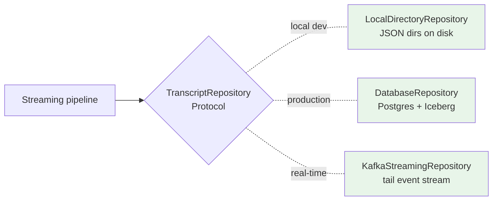
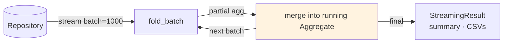

# ADR 0011: Repository Pattern + Streaming Pipeline for Production Volume

- **Status:** Accepted
- **Date:** 2026-05-06
- **Builds on:** ADR 0008 (data layer for 100M+ records)

## Context

ADR 0008 documented the *target* tiered architecture (Postgres + Iceberg + ClickHouse + OpenSearch + Redis). It promised that the application code's *shape* wouldn't change at scale, only the substrate. That promise was unverified — the analytical pipeline still loaded every meeting into pandas via `data_loader.load_all_meetings()`, which fails at ~10M records (memory) and reads from local JSON only.

Two related gaps:
1. **No abstraction over the data source.** Swapping local-files for Postgres / Iceberg / Kafka would require rewriting every call site.
2. **No streaming compute path.** Even with a database backend, the pipeline still pulled everything at once and held it in memory.

## Decision

Two coordinated changes that together turn the architecture promise into running code:

### 1. `TranscriptRepository` Protocol (`src/repository.py`)

A read-only interface that abstracts where meetings come from:

```python
@runtime_checkable
class TranscriptRepository(Protocol):
    def count(self) -> int: ...
    def get(self, meeting_id: str) -> Optional[Meeting]: ...
    def stream(self, *, batch_size: int = 1000) -> Iterator[list[Meeting]]: ...
    def all(self) -> list[Meeting]: ...
```

Today we ship one implementation: `LocalDirectoryRepository`. The production path adds two more (documented in ADR 0008, both swap-in via `default_repository()`):



No call site changes when swapping implementations. The pipeline only knows the protocol.

### 2. Streaming analytical pipeline (`src/streaming.py`)

A fold-based pipeline that processes meetings in fixed-size batches and merges per-batch aggregates into a running total. Memory is **O(batch_size)** regardless of total dataset size.



Two key properties of `Aggregate`:

- **Mergeable** — `agg_a.merge(agg_b)` produces the union as if both batches were processed sequentially. This makes the fold *trivially parallelizable*: split the repository across N Ray Data workers, each builds its own Aggregate, then reduce-merge into one. The same code runs on a laptop (1 worker) or a 100-node cluster.
- **Bounded memory** — only running totals (counters + small lists of friction-moment metadata) are held; raw transcript content is GC'd after each batch.

### Verified equivalence

Streaming output **must match** in-memory output on the same input. Tests in `tests/test_streaming.py` enforce this:

| Property | Verified by |
|---|---|
| Total meetings | `test_streaming_total_meetings_matches_sample` |
| Call-type distribution | `test_streaming_call_type_distribution_matches` |
| Average sentiment (within 0.001) | `test_streaming_avg_sentiment_matches` |
| Friction moments (sharp pivots) | `test_streaming_finds_same_friction_moments` |
| Top action-item owners | `test_streaming_top_action_owners_match` |
| Aggregate merge associativity | `test_aggregate_merge_is_associative` |

If these tests ever fail, the streaming fold has diverged from in-memory and is wrong.

## Related production-readiness fixes shipped with this ADR

| Change | Why |
|---|---|
| **Alembic migrations** (`alembic/`, `alembic.ini`) | Schema evolution discipline — no more relying on `Base.metadata.create_all()` magic. The current schema is captured in `alembic/versions/20260506_0001_initial_schema.py`. New migrations go through `alembic revision --autogenerate`. |
| **Postgres connection pool tuning** (`src/db.py`) | Explicit `pool_size=5`, `max_overflow=10`, `pool_pre_ping=True`, `pool_recycle=1800`. Catches stale connections from PgBouncer / RDS failovers; rotates before LB idle timeouts. SQLite uses NullPool (no pooling — single-file DB doesn't benefit). |
| **`run_analysis.py --streaming`** | New CLI mode runs the streaming pipeline end-to-end. Defaults preserve in-memory behavior (correct for development); `--streaming --batch-size N` is the production path. |
| **`api/state.py` consumes the repository** | The API's pipeline-state cache builds via `default_repository().all()` instead of calling `data_loader.load_all_meetings()` directly. Tests can override the source via `state.set_repository(repo)`. Swapping the API to a `DatabaseRepository` is now a single-function change in `default_repository()`. |
| **`alembic upgrade head` on container start** | Dockerfile entrypoint runs migrations before `uvicorn` execs. Idempotent and Alembic locks safely under multi-replica boots, so this is the production-path schema-bring-up. |

## Consequences

**Positive**
- The 100M+ promise from ADR 0008 is now backed by running code, not just doc
- A real `DatabaseRepository` slot is one new class, not a rewrite — same Protocol, swap `default_repository()` to return it
- `Aggregate.merge` makes the fold parallelizable for free — Ray Data / Spark / Beam all consume mergeable folds natively
- Schema evolution has a real workflow (alembic) instead of relying on metadata-create-all
- Postgres connection pool is tuned for production (pre-ping + recycle) before we actually deploy to Postgres

**Negative**
- The streaming pipeline skips clustering + visualizations (those need the full set in memory). At production volume, clustering is computed separately in the columnar warehouse (ADR 0008's analytical tier); visualizations are produced on demand from sampled data, not the full set.
- Two code paths now exist (in-memory and streaming). Tests gate equivalence, but new insights need to be added to both `insights.py` (in-memory) and `streaming.fold_batch` (streaming) — that's friction.
- Alembic adds 4 small files of metadata. Worth it.

**Neutral**
- `LocalDirectoryRepository` is still backed by the local filesystem. Replacing it with Postgres/Iceberg backends is a future PR; the foundation is in place.

## When to revisit

- A new aggregate signal lands in `insights.py` that doesn't have a streaming equivalent → add a `fold_batch` method or split the metric out
- Streaming throughput becomes the bottleneck → switch from sequential fold to Ray Data parallel fold (Aggregate.merge already supports this)
- Schema migrations grow complex enough to need branching → adopt alembic's branch labels

## Related

- ADR 0005 — original "no database" verdict (still right below the in-memory envelope)
- ADR 0008 — target tiered storage architecture (this ADR is the foundation)
- ADR 0010 — auto-scaling ML pipeline (uses the same repository interface)
- `src/repository.py` — Protocol + LocalDirectoryRepository
- `src/streaming.py` — folding pipeline + Aggregate
- `tests/test_streaming.py` — 14 tests pinning equivalence with in-memory mode
