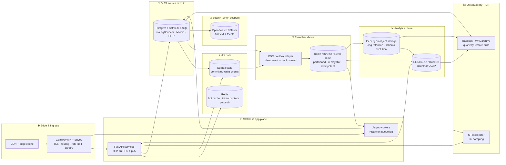

# ADR 0014: Cloud-Agnostic Split-Plane Architecture for 100M+ Records

- **Status:** Accepted (consolidates ADRs 0008, 0010, 0013 against the cloud-agnostic research recommendations)
- **Date:** 2026-05-07
- **References:** [Production-ready cloud-agnostic system design for autoscaling beyond 100 million records](../../../research/deep-research-report.md)

## Context

ADR 0008 sketched a tiered storage model. ADR 0010 covered the ML auto-scaling. ADR 0013 covered the API auto-scaling. None of those individually answered the question *"if you handed this design to a SRE on a fresh cluster, what does the production blueprint look like end to end?"* The cloud-agnostic research report in `research/` answers exactly that question. This ADR adopts that blueprint as the reference architecture, identifies which parts of it the codebase already implements, and closes the remaining gaps with concrete artifacts.

The research's load-bearing observation: at 100M+ records, **workload shape dominates row count** as the architectural risk. The dominant risks are hot-key concentration, write amplification, cross-region latency, multi-tenant isolation, analytical fan-out, and recovery time. The defensive answer is a **split-plane architecture** that puts each concern on a tier sized for it.

## Decision

Adopt the split-plane reference architecture below. Each plane has a single job, sized and scaled independently. This consolidates ADRs 0008, 0010, and 0013 into one diagram and one component map; the existing ADRs continue to govern their respective tiers.

### Component-by-component status

For each component the research recommends: what's already shipped in this codebase, what's a manifest-only gap, what's a future PR.

| Plane | Component | Status in this repo |
|---|---|---|
| Edge | CDN + Gateway API + Envoy | **Shipped:** `deploy/k8s/gateway.yaml` (Gateway + HTTPRoute + ReferenceGrant — splits stable/canary traffic, enforces HTTP→HTTPS redirect, isolates probe + admin paths from CDN caching) and `deploy/cdn-runbook.md` (CloudFront/Fastly cutover + validation). |
| Edge | Three-layer rate limiting (tenant quota + concurrency + adaptive) | **All three shipped:** per-tenant slowapi key (`api/limiter.py`), `BackpressureMiddleware`, strict admin login limiter, plus the new `AdaptiveThrottleMiddleware` (`api/adaptive_throttle.py`) — sliding-window p95 → piecewise-linear shed probability when the SLO breaches, capped at 95% so probes still go through. |
| Stateless | FastAPI services + HPA | Shipped — `deploy/k8s/{deployment,hpa}.yaml`. HPA on RPS + p95 + CPU floor. |
| Stateless | Async workers + KEDA | **Worker manifest** shipped (`deploy/k8s/worker.yaml`); HPA via Prometheus-Adapter external metric. **Native KEDA `ScaledObject`** added in this ADR (`deploy/k8s/keda-scaledobjects.yaml`) — both work; KEDA is more idiomatic for queue-driven scaling. |
| Hot | Redis (cache + rate limit + pub/sub) | **Code path** shipped (`api/limiter.py`, `api/jobs.py`, `api/admin/routes.py` strict limiter). **Manifest** added in this ADR (`deploy/k8s/redis.yaml`). |
| Hot | Outbox table for CDC | **Model added** in this ADR (`src/models_db.py::OutboxEvent`) + alembic migration + relayer (`api/outbox.py`). Poison rows (`delivery_attempts ≥ max`) route to a DLQ via the new `DLQPublisher` wrapper. Operator surface: `GET /api/v1/admin/outbox/stuck` + `POST /api/v1/admin/outbox/replay` for the runbook flow in `deploy/incident-runbooks.md`. |
| Edge | Idempotency-Key header on POST/PUT/PATCH/DELETE | **Shipped** as `api/idempotency.py`. Opt-in via the `idempotency.enabled` runtime setting; per request via the `Idempotency-Key` header. Same key + same hash = cached replay; same key + different hash = `409 Conflict`. Storage: Redis when configured, in-process fallback otherwise. Wired into both the public API and the admin app — admin write endpoints (login, password rotation, settings updates, snapshot rebuild) are exactly the targets where retries cause duplicates. |
| OLTP | PostgreSQL via PgBouncer + PITR | Pool tuning auto-detects PgBouncer (`src/db.py`); `deploy/k8s/pgbouncer.yaml` ships the proxy. PITR posture documented in `deploy/dr-runbook.md`. **`DatabaseRepository`** in `src/repository.py` provides `TranscriptRepository` reads from a JSON-blob `meetings` table; `transcripts.repository` runtime setting flips between filesystem (dev) and database (production) without a redeploy. |
| Stream | Kafka / Kinesis | **Manifest shipped:** `deploy/k8s/kafka.yaml` (Strimzi Kafka cluster sized to ≥24 partitions, `.events` + `.events.dlq` topics, KafkaUser ACLs). **`KafkaPublisher`** in `api/outbox_kafka.py` — synchronous `confluent-kafka` producer that satisfies `outbox.Publisher`, propagates the outbox `trace_id` as a W3C `traceparent` header. Production wiring: pair primary + DLQ via `DLQPublisher`. |
| OLAP | ClickHouse / DuckDB-on-Iceberg | Documented (ADR 0008's analytical tier). The streaming pipeline (`src/streaming.py`) is the producer; ClickHouse ingestion is operationally provisioned, not in-app. |
| Search | OpenSearch | **Application code shipped:** `api/search.py` exposes the `SearchIndex` Protocol with `LocalSearchIndex` (dev) + `OpenSearchIndex` (production via `opensearch-py`) + `CachedSearchIndex` (Redis query cache, 1-min TTL, write-invalidating). Switch backends via `search.backend` runtime setting. Cluster provisioning is operator-side. |
| Hot | **Entity-level Redis cache** | **Shipped:** `api/cache.py` — read-through helper with TTL jitter, single-flight, negative caching, namespaced invalidation. `CachedTranscriptRepository` decorator wraps any backing repo. Used by the LLM gateway for response caching as well. Closes the deferred entity-cache item from the previous round. |
| Obs | OpenTelemetry collector + tail sampling | Shipped — `deploy/k8s/otel-collector.yaml` + `api/observability.py` head sampler. |
| Obs | Backups + DR + restore drills | **`deploy/dr-runbook.md`** (added in this ADR) documents PITR posture, RPO/RTO defaults, restore-drill cadence, and DR failover sequence. |
| Delivery | Argo Rollouts canary | **Manifest added** in this ADR (`deploy/k8s/argo-rollout.yaml`). |
| Identity | OAuth/OIDC + mTLS + SPIFFE workload identity | Out of scope for current deliverables. ADR 0006 documents the JWT migration trigger; SPIFFE adoption follows when service-to-service trust moves out of the cluster's network boundary. |

### Cache invalidation discipline (added)

The research is explicit that cache stampedes and stale reads are the load-bearing failure mode for hot-path Redis. We implement the three patterns it calls out:

- **TTL jitter** — every cache write randomizes the TTL by ±10% so synchronized expiry doesn't herd. (`api/caching.py::ttl_with_jitter`.)
- **Single-flight coalescing** — concurrent misses for the same key share a single underlying compute. (`api/caching.py::SingleFlight`.)
- **Stale-while-revalidate** — `cached()` emits `Cache-Control: ... stale-while-revalidate=N` so CDNs and browser caches can serve a stale payload while asynchronously revalidating against origin. Smooths the cliff between fresh and expired (RFC 5861).
- **Event-driven invalidation** — committed writes append an `OutboxEvent`; the relayer fans them out, and consumers drop affected cache entries. (Already partially in place via `LISTEN/NOTIFY` for runtime settings; the same pattern extends to entity caches.)

### Capacity envelope (illustrative)

The research's capacity model lands on these planning numbers. Restated here so the deployment checklist has concrete defaults:

| Item | Default | Source |
|---|---|---|
| Peak API rate | 12,000 RPS | Research §"Illustrative design basis" |
| Mix | 75% read / 25% write | Research §"Illustrative design basis" |
| Replicas at peak (3-AZ N-1) | 60 pods (40 active per zone after one zone failure) | Research §"Capacity planning" |
| OLTP write rate | 3,000 writes/s | Research §"Capacity planning" |
| Stream throughput | ~12 MiB/s → ≥24 partitions (with 2× headroom) | Research §"Capacity planning" |
| Logical OLTP footprint | ~143 GiB raw → ~358 GiB usable → ~1.07 TiB at RF=3 | Research §"Capacity planning" |
| Replicated capacity at peak | ~1.4 TiB provisioned (with 30% headroom) | Research §"Capacity planning" |

These shape `deploy/k8s/hpa.yaml` (HPA target = 200 RPS/pod), `deploy/k8s/pgbouncer.yaml` pool sizing, and the KEDA partition count guidance in this ADR.

### SLOs

Adopted directly from the research's recommended set; codified in `deploy/slos.md`. These thresholds drive the HPA's `http_request_duration_p95` target and the OTel collector's tail-sampling threshold.

### Schema evolution: expand/contract

Every migration follows the seven-step expand/contract pattern from the research: add nullable column → dual-write → backfill in resumable chunks → CDC keeps targets in sync → shadow read → cut over gradually → drop the old shape after a soak window. Alembic migrations live in `alembic/versions/`. The migration template note in `alembic/README.md` (added) reminds contributors of the discipline.

### Migration trigger table (when each tier turns on)

| Tier | Trigger to turn on | Effort |
|---|---|---|
| 1. In-memory pandas (current default) | — | Done |
| 2. Postgres for derived state + outbox | 100k records / multi-instance need | ~1 week (SQLAlchemy already in place) |
| 3. Redis cache + cluster-wide rate limit | p95 dashboard latency > 200 ms | ~3 days |
| 4. Kafka ingestion + worker streaming jobs | Real-time use cases | ~2 weeks |
| 5. ClickHouse / DuckDB-on-Iceberg | Cross-time analytics | ~1 week |
| 6. OpenSearch full-text | Free-text dashboard queries | ~3 days |
| 7. Multi-tenancy (per-tenant LoRA + Postgres isolation) | First multi-tenant customer | ~2 weeks |

(Same table as ADR 0008 step #2-#7; reproduced here for the consolidated reading.)

## Consequences

**Positive**
- One canonical reference architecture instead of three partial ones (ADRs 0008/0010/0013).
- Cache stampede + thundering herd risks closed at the code level via TTL jitter + single-flight.
- Outbox pattern lets future Kafka adoption be a relayer-config change, not an app rewrite.
- KEDA + Cluster Autoscaler manifests give event-driven scaling primitives that match the research's blueprint.
- DR posture and SLOs are now explicit, runbook-grade artifacts rather than aspirational prose.

**Negative**
- More deploy manifests and runbooks to maintain. This is the price of the production blueprint.
- The outbox + relayer adds two new failure modes (relayer crash, replay duplicates) that need monitoring.
- Some recommendations (Argo Rollouts, SPIFFE) are documented but not yet exercised against a real deploy in this repo.

**Neutral**
- Cloud-specific managed equivalents are listed in `deploy/cloud-equivalents.md`. The architecture stays cloud-agnostic; the manifest set runs on any conformant Kubernetes.

## When to revisit

- A managed product subsumes multiple tiers (MotherDuck, Neon, Aurora Serverless v2 with cross-region) — simplify the diagram.
- Geographic distribution becomes a hard requirement → revisit distributed-SQL choice (CockroachDB / Spanner / YugabyteDB) per the research's NewSQL guidance.
- Multi-tenancy lands → revisit ADR 0006's JWT migration and add per-tenant fine-tuned LoRA per ADR 0010.
- Frontier-LLM gateway (ADR 0012) ships → its rate-limit budget and audit log integrate with this tier's three-layer rate limiting.

## Related

- ADR 0006 — auth (the JWT migration trigger this ADR implies)
- ADR 0008 — data layer (this ADR is the cloud-agnostic consolidation)
- ADR 0009 — admin panel + runtime settings (operational layer of the split plane)
- ADR 0010 — auto-scaling ML pipeline (Train/Serve plane of the diagram)
- ADR 0011 — repository pattern + streaming (producer side of the OLTP→Kafka edge)
- ADR 0012 — LLM cascade (uses the same three-layer rate limiting)
- ADR 0013 — API tier auto-scaling (Stateless app plane of the diagram)
- `research/deep-research-report.md` — the original cloud-agnostic blueprint
