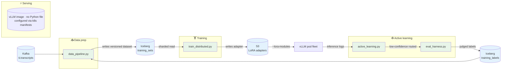
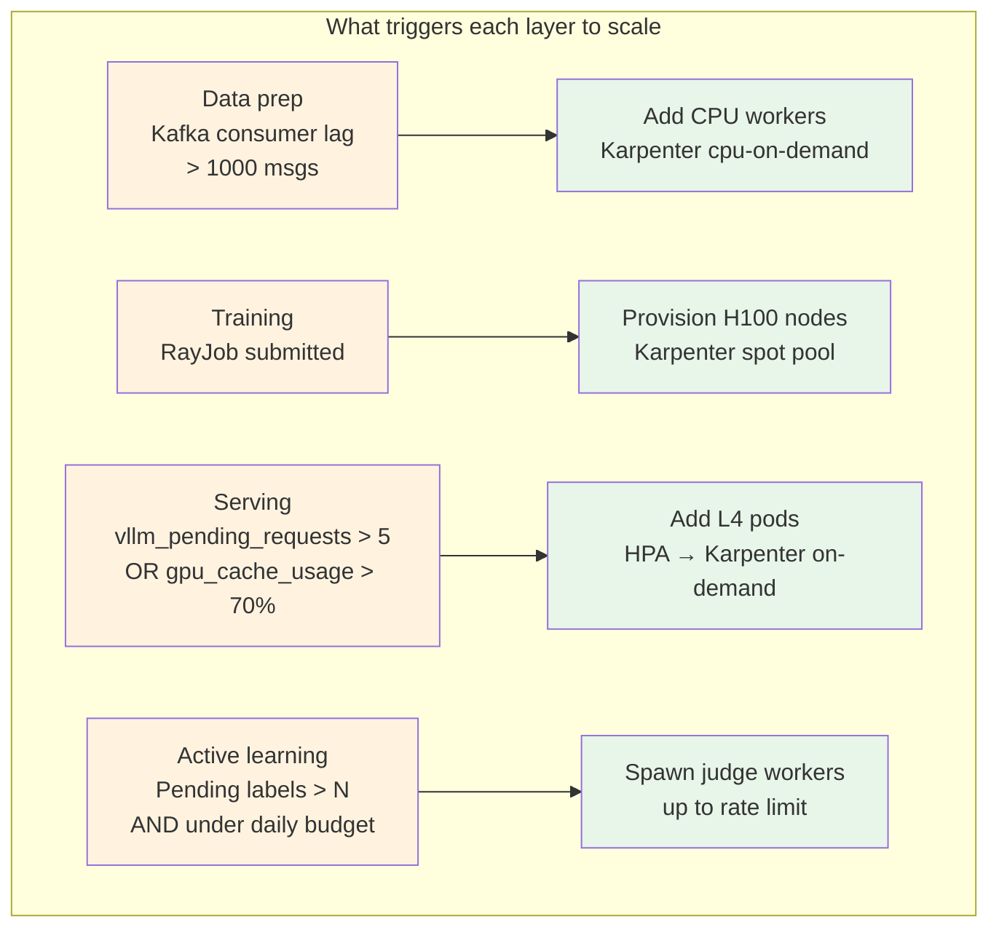

# Scaling — production ML pipeline

The single-H100 recipe in [`../code/finetune_v3.py`](../code/finetune_v3.py) is the *workshop* path. This directory holds the production path that scales from a single notebook to a multi-node training cluster and an autoscaled inference fleet.

**See [ADR 0010](../../docs/adr/0010-auto-scaling-ml-pipeline.md) for the full architecture rationale.** This README is the code-level entry point.

## How the four files fit together



Each file is the entry point for **its layer's lifecycle**. They run on **different infrastructure** with **independent autoscaling triggers** — that's the architecture working as intended.

## Layout

```
scaling/
├── README.md                  # this file
├── data_pipeline.py           # Ray Data streaming for production-volume training data
├── train_distributed.py       # Ray Train + FSDP — same trainer logic, 8-node ready
├── active_learning.py         # production-traffic → training-queue feedback loop
├── eval_harness.py            # LLM-as-judge evaluation at scale (replaces ROUGE-only)
├── k8s/
│   ├── train-job.yaml         # KubeRay training job (auto-shutdown when done)
│   ├── serving-deployment.yaml  # vLLM serving with multi-LoRA hot-swap
│   ├── hpa.yaml               # autoscaling on queue depth + GPU cache %
│   └── karpenter-nodepool.yaml  # cost-optimized GPU node provisioning
└── observability/
    └── grafana-dashboard.json # production training + serving dashboard (sketch)
```

## Auto-scaling layers

| Layer | Code | Manifest | Scales on |
|---|---|---|---|
| Data prep | `data_pipeline.py` | `train-job.yaml` (Ray cluster) | Kafka lag |
| Training | `train_distributed.py` | `train-job.yaml` | Job submission |
| Serving | (uses vLLM directly) | `serving-deployment.yaml` + `hpa.yaml` | Queue depth + GPU cache % |
| Active learning | `active_learning.py` | (worker pool) | Pending labels in queue |

### Scaling triggers — at a glance



Each layer reaches **zero** when idle: Karpenter consolidates empty nodes within 60 s, HPA's `scaleDown` policy floors at the `minReplicas: 1` always-warm baseline for serving, and the active-learning pool literally has no work when the inference logs are empty.

## Running

### Locally — single-process smoke test

The Python files use lazy imports for ML dependencies. They import without Ray / vLLM / torch installed, but they require those at execution time. To smoke-test signatures:

```bash
python -c "from gemma_finetune.scaling import data_pipeline, train_distributed, active_learning, eval_harness"
```

### On a Ray cluster — distributed training

```bash
# 1. Provision a Ray cluster on K8s (KubeRay)
kubectl apply -f scaling/k8s/train-job.yaml

# 2. Submit the training job
ray job submit --working-dir=. -- python gemma_finetune/scaling/train_distributed.py \
    --num-workers 8 --gpus-per-worker 4 \
    --dataset s3://ti-data/training/v=2026-05-06/ \
    --output s3://ti-models/gemma4/v5
```

### Production serving — vLLM with autoscaling

```bash
kubectl apply -f scaling/k8s/serving-deployment.yaml
kubectl apply -f scaling/k8s/hpa.yaml
kubectl apply -f scaling/k8s/karpenter-nodepool.yaml
```

Inference requests land at the deployment's service; HPA reads `vllm_pending_requests` + `vllm_gpu_cache_usage_perc` from Prometheus and scales pods 0..N (with `minReplicas: 1` always-warm baseline).

## What's intentionally NOT in this directory

- **Real cluster credentials** — manifests are templates. Actual deploy uses the cluster's auth.
- **CI for the cluster paths** — the k8s manifests are validated by `kubectl apply --dry-run=client`; smoke-tested in a real pre-prod cluster, not in unit tests.
- **A working `requirements.txt` for the ML stack** — Ray, vLLM, FSDP all pull massive deps. They live in the training/serving container images, not the project's main `requirements.txt`. Container image definitions belong in a separate infra repo per ADR 0010.

## Why this isn't a unified "main.py" you can just run

The whole point of auto-scaling is that the data, training, and serving layers run on **different infrastructure with independent lifecycles**. A single entry point would defeat the design. Each file is the entry point for *its* layer — that's the architecture working as intended.
